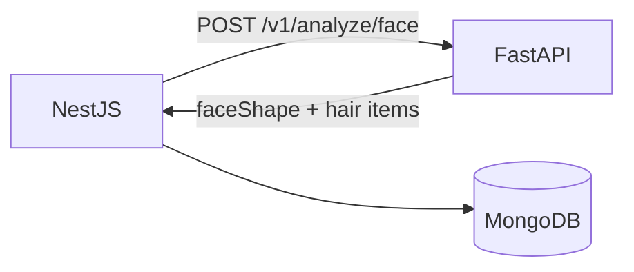

# Lumora — AI Service

| Field | Value |
|---|---|
| Status | Active source of truth |
| Service | FastAPI (Python) |
| Caller | NestJS GraphQL backend only |
| Related | [ARCHITECTURE.md](./ARCHITECTURE.md) · [API.md](./API.md) · [MVP.md](./MVP.md) · [DATABASE.md](./DATABASE.md) · [SECURITY.md](./SECURITY.md) |

---

## 1. Purpose

This document defines the role, responsibilities, MVP capabilities, and integration rules for Lumora’s AI service.

Lumora’s AI layer performs **face analysis** and produces **personalized recommendations**. It is not positioned as an AI image generator product.

---

## 2. Role in the Platform

```text
MediaPipe landmarks (frontend)
        → NestJS GraphQL
        → FastAPI AI Service
        → face shape + hair recommendations
        → NestJS persists + returns to frontend
```

| Responsibility | Owner |
|---|---|
| Landmark extraction | Frontend (MediaPipe) |
| Auth, validation, persistence | NestJS |
| Face shape detection | FastAPI |
| Hair recommendation inference | FastAPI |
| History storage | NestJS / MongoDB |

---

## 3. MVP AI Capabilities

| Capability | Description |
|---|---|
| Face analysis intake | Accept normalized landmark (and related) payload from NestJS |
| Face shape detection | Classify face shape from analysis inputs |
| Hair recommendation | Return ranked/structured hair style recommendations |
| Structured response | Return machine-readable JSON for NestJS mapping |

### Out of scope for MVP AI

- Glasses recommendation
- Beard recommendation
- Outfit recommendation
- Color analysis
- Virtual try-on rendering
- Chat / LLM stylist conversation
- Generative image synthesis as the primary output

---

## 4. Service Interface (MVP)

See [API.md](./API.md) for the full internal contract. Summary:

| Endpoint | Purpose |
|---|---|
| `GET /health` | Health check |
| `POST /v1/analyze/face` | Face shape + hair recommendations |

### Input (conceptual)

- Correlation / request id (optional)
- MediaPipe-derived landmarks (normalized)
- Optional scan metadata (source, versions)

### Output (conceptual)

- `faceShape`
- `recommendations.category = hair`
- `recommendations.items[]` with title/description/score/key

---

## 5. Model and Algorithm Policy

| Topic | MVP policy |
|---|---|
| Landmark source | MediaPipe on frontend is the confirmed capture path |
| Analyze input | **Landmarks only** — no image required (ADR-011) |
| Face shape taxonomy | Fixed set in Section 6 (ADR-012) |
| Hair recommendations | **Hybrid**: AI rank/explain + match to static JSON catalog (ADR-013, ADR-021) |
| Catalog format | **Static JSON** in MVP; MongoDB migration later (ADR-021) |
| Audience | Men-focused catalog/copy (ADR-014) |
| Model choice for face-shape classifier | Specific ML/rules implementation still open |
| Determinism | Prefer stable outputs for the same landmark input where practical |
| Explainability | Short description text per recommendation item supported |
| Failure mode | Return explicit error codes for invalid/unusable inputs |

---

## 5.1 Hybrid hair recommendation (ADR-013 / ADR-021)

```text
landmarks → face shape
         → match / rank against static JSON hairstyle catalog (men)
         → AI explains / orders items
         → return structured items to NestJS
```

---

## 6. Face Shape Taxonomy (Accepted — ADR-012)

Accepted enum for product/API alignment:

| Value | Meaning |
|---|---|
| `OVAL` | Oval |
| `ROUND` | Round |
| `SQUARE` | Square |
| `HEART` | Heart |
| `OBLONG` | Oblong / rectangular |
| `DIAMOND` | Diamond |
| `TRIANGLE` | Triangle |
| `OTHER` | Fallback when confidence is low or class unknown |

Changes to this set require a new ADR plus API/docs updates.

---

## 7. Hair Recommendation Output Rules

| Rule | Detail |
|---|---|
| Category | MVP always `hair` |
| Item count | Product/AI decision; return at least one item on success |
| Ranking | Use `score` when available; NestJS may pass through order |
| Safety | No medical claims; styling suggestions only |
| Personalization basis | Driven by face analysis (face shape at minimum) |

---

## 8. Integration Rules

| Rule ID | Rule |
|---|---|
| AI-01 | Only NestJS may call FastAPI for product flows |
| AI-02 | FastAPI must not become the user database |
| AI-03 | FastAPI must not issue end-user JWTs for the product |
| AI-04 | Invalid landmark payloads fail closed with structured errors |
| AI-05 | Successful responses must be mappable into GraphQL + MongoDB history records |



---

## 9. Runtime Expectations

| Area | Expectation |
|---|---|
| Protocol | HTTP JSON |
| Auth to service | Internal only; exact mechanism open |
| Timeouts | NestJS must set timeouts around AI calls |
| Idempotency | Correlation ids recommended for tracing |
| Logging | Log request ids + error codes; avoid logging sensitive raw imagery if stored |

---

## 10. Quality and Evaluation (MVP)

MVP does not require research-paper accuracy. It requires a **working, demable pipeline**.

| Gate | Meaning |
|---|---|
| Functional | Valid landmarks → face shape + ≥1 hair recommendation |
| Contract | Response matches NestJS mapper expectations |
| Resilience | Invalid payload → structured error, no crash loop |
| Iteration | Models/rules can improve without changing platform boundaries |

---

## 11. Future AI Extensions

When roadmap features arrive, prefer extending FastAPI (or versioned endpoints) behind NestJS:

| Feature | Extension pattern |
|---|---|
| Glasses / Beard / Color | New fields or endpoints under `/v1` or `/v2` |
| Outfit | Separate analyze/recommend domain |
| Virtual try-on | New pipeline; still NestJS-mediated |
| Chat | Separate conversational service/domain; still not browser→AI direct |

---

## 12. Open AI Decisions

| Decision | Status |
|---|---|
| Concrete face-shape model (rules vs ML classifier) | Open |
| Confidence thresholds for `OTHER` | Open |
| Exact static JSON hairstyle catalog schema/content | Open (format decided; content TBD) |
| GPU vs CPU deployment | Open |
| Batch vs single-request inference | Open (MVP assumes per-request / synchronous) |

---

## 13. Summary

The Lumora AI service (`lumora-ai`) turns NestJS-provided **landmarks JSON** into **face shape** and **hybrid men-focused hair recommendations** matched to a **static JSON catalog**. In production, requests must include `X-API-KEY`. The browser never talks to FastAPI.
