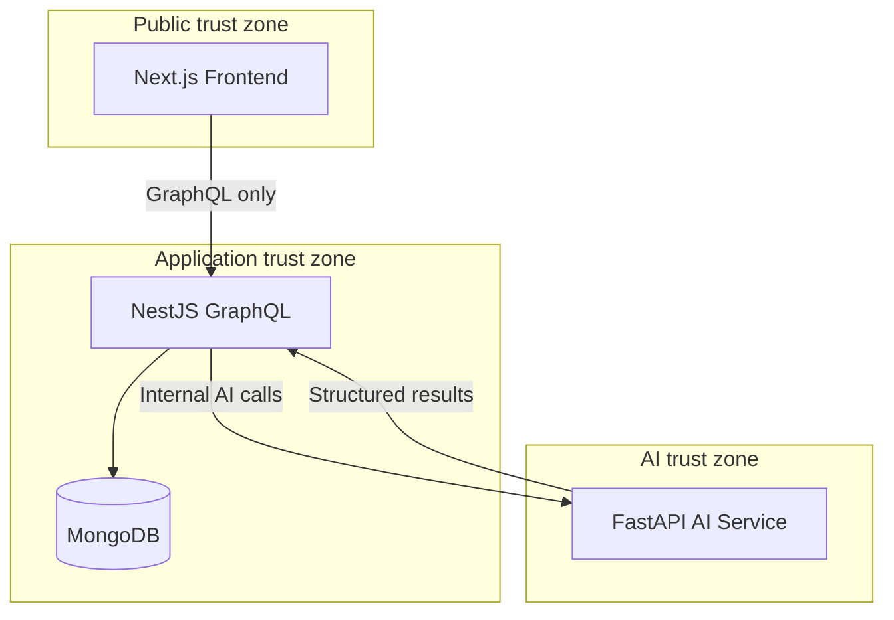
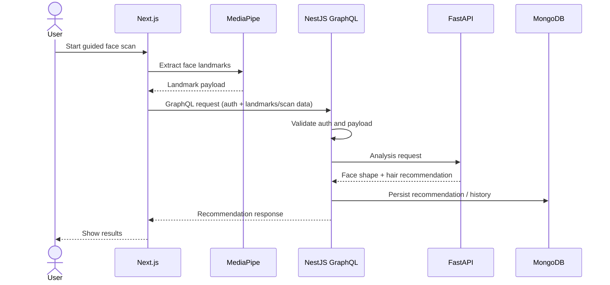

# Lumora — System Architecture

| Field | Value |
|---|---|
| Status | Active source of truth |
| Product | [PROJECT.md](./PROJECT.md) |
| Related | [MONOREPO.md](./MONOREPO.md) · [API.md](./API.md) · [AI.md](./AI.md) · [DATABASE.md](./DATABASE.md) · [SECURITY.md](./SECURITY.md) · [DECISIONS.md](./DECISIONS.md) |

---

## 1. Purpose

This document defines the runtime architecture of Lumora: components, trust boundaries, data flow, and non-negotiable integration rules.

It does **not** define GraphQL schema details ([API.md](./API.md)), MongoDB schemas ([DATABASE.md](./DATABASE.md)), AI model internals ([AI.md](./AI.md)), or package folder layout ([MONOREPO.md](./MONOREPO.md)).

---

## 2. Architectural Goals

| Goal | Description |
|---|---|
| Clear boundaries | Frontend, backend, and AI service have explicit responsibilities |
| Mediated AI | Clients never talk to the AI service |
| MVP focus | Architecture supports face scan → analysis → hair recommendation → history |
| Extensibility | Future features can attach without redesigning the core pipeline |
| Decision discipline | Unconfirmed infrastructure is not assumed; see Section 11 |

---

## 3. Confirmed System Context

Lumora is a **multi-repo** platform with three primary runtime surfaces plus MongoDB (`lumora-frontend`, `lumora-backend`, `lumora-ai`).

```text
┌─────────────────────────────────────────────────────────────┐
│                        Client Device                        │
│  ┌───────────────────────────────────────────────────────┐  │
│  │              Next.js Frontend                         │  │
│  │  Guided Face Scan · MediaPipe Landmarks · UI          │  │
│  └───────────────────────────┬───────────────────────────┘  │
└──────────────────────────────┼──────────────────────────────┘
                               │ GraphQL (HTTPS)
                               ▼
┌──────────────────────────────────────────────────────────────┐
│                 NestJS GraphQL Backend                       │
│  Auth · Validation · Orchestration · Persistence · Policy    │
└───────────────┬──────────────────────────────┬───────────────┘
                │                              │
                ▼                              ▼
        ┌───────────────┐            ┌─────────────────────┐
        │   MongoDB     │            │  FastAPI AI Service │
        │  App data     │            │  Face analysis      │
        └───────────────┘            │  Recommendations    │
                                     └─────────────────────┘
```

| Component | Technology | Public to end users? |
|---|---|---|
| Frontend | Next.js | Yes |
| Backend API | NestJS + GraphQL | Yes (application API) |
| Database | MongoDB | No |
| AI Service | FastAPI (Python) | No (internal only) |

---

## 4. Component Responsibilities

### 4.1 Next.js Frontend

Responsible for:

- Authentication UX (sign-up / sign-in flows that call NestJS)
- Guided face scan experience
- Running **MediaPipe** face landmark extraction on the client
- Sending landmark / scan payloads to NestJS via GraphQL
- Rendering face shape results, hair recommendations, and history

Must **not**:

- Call the FastAPI AI service directly
- Persist authoritative recommendation history locally as the system of record
- Bypass NestJS for business logic or AI orchestration

### 4.2 NestJS GraphQL Backend

Responsible for:

- Authentication and authorization enforcement
- GraphQL API for the frontend
- Input validation and request shaping
- Calling the FastAPI AI service
- Mapping AI responses into API responses
- Persisting users, analysis results, and recommendation history in MongoDB
- Enforcing product and security policy at the boundary

Must **not**:

- Embed long-running heavy ML inference that belongs in the AI service
- Expose FastAPI as a public client endpoint

### 4.3 FastAPI AI Service

Responsible for:

- Receiving analysis requests from NestJS only
- Face analysis (face shape detection)
- Producing hair recommendation results for MVP
- Returning structured analysis outputs to NestJS

Must **not**:

- Be reachable by the Next.js frontend
- Own end-user authentication for the product
- Become the system of record for user accounts or recommendation history

### 4.4 MongoDB

Responsible for:

- Durable storage for application data required by MVP

Must **not**:

- Be accessed directly by the frontend
- Be accessed directly by the AI service for product writes in the default architecture (NestJS owns persistence)

---

## 5. Hard Integration Rules

| Rule ID | Rule |
|---|---|
| ARCH-01 | Frontend communicates only with NestJS GraphQL for application operations |
| ARCH-02 | NestJS is the only component that calls FastAPI for product AI flows |
| ARCH-03 | FastAPI is an internal service, not a public browser API |
| ARCH-04 | MediaPipe landmark extraction runs in the frontend for the MVP scan pipeline |
| ARCH-05 | MongoDB is accessed by NestJS as the application data store |
| ARCH-06 | Future features must extend this pipeline; they must not introduce a second client→AI path |



---

## 6. End-to-End MVP Request Flow

### 6.1 Authenticated recommendation flow



### 6.2 History flow

```text
User → Frontend → NestJS GraphQL → MongoDB → NestJS → Frontend → User
```

History reads do not require the AI service unless a later decision introduces re-analysis.

---

## 7. Logical Backend Domains (MVP)

These are logical domains, not a mandated folder tree (see [MONOREPO.md](./MONOREPO.md)).

| Domain | Responsibility |
|---|---|
| Auth | Identity, session/token handling, route protection |
| Users | User profile records needed by the product |
| Scan / Analysis orchestration | Accept landmark/scan input, call AI, normalize results |
| Recommendations | Hair recommendation responses and history persistence |
| Common / Config | Shared config, guards, error handling |

Post-MVP domains (wardrobe, shopping, chat, etc.) are not required for MVP architecture readiness.

---

## 8. Data Flow Summary

| Data | Produced by | Consumed by | Stored by |
|---|---|---|---|
| Auth credentials / tokens | Frontend + NestJS | NestJS | NestJS / MongoDB (as designed in auth docs) |
| Face landmarks | Frontend (MediaPipe) | NestJS → FastAPI | Per [DATABASE.md](./DATABASE.md) / [AI.md](./AI.md) |
| Face shape result | FastAPI | NestJS → Frontend | NestJS → MongoDB |
| Hair recommendations | FastAPI | NestJS → Frontend | NestJS → MongoDB |
| Recommendation history | NestJS | Frontend | MongoDB |

Exact field-level schemas are defined in [DATABASE.md](./DATABASE.md) and [API.md](./API.md).

---

## 9. Failure and Boundary Expectations

| Scenario | Expected ownership |
|---|---|
| Invalid or incomplete landmarks | NestJS validates before calling AI; frontend may also pre-validate UX |
| AI service unavailable | NestJS returns a controlled API error; frontend shows recoverable failure |
| Unauthenticated access to protected operations | NestJS rejects the request |
| AI returns unusable payload | NestJS treats it as upstream failure; does not persist corrupt recommendations as success |

Detailed error codes and GraphQL error shapes belong in [API.md](./API.md).

---

## 10. Extensibility Model (Post-MVP)

Future features should attach as new capabilities behind the same boundaries:

```text
Frontend → NestJS GraphQL → (optional new services) → MongoDB
                         └→ FastAPI / specialized AI endpoints
```

| Future feature | Architectural expectation |
|---|---|
| Glasses / Beard / Color analysis | Extend analysis/recommendation domains; keep AI behind NestJS |
| Outfit / Wardrobe / Shopping | New backend domains + MongoDB collections; still GraphQL-facing |
| Virtual try-on | New pipeline capability; no direct frontend→AI shortcut |
| Chat | New domain behind NestJS; AI still mediated if used |

---

## 11. Confirmed vs Still Open (Infra)

| Topic | Status |
|---|---|
| Auth providers | Email/password + Google only (ADR-009) |
| Token transport | JWT Bearer (ADR-010) |
| Analyze payload | Landmarks JSON only (ADR-011) |
| Hair catalog | Static JSON (ADR-021) |
| Redis / BullMQ | Not in MVP; future OK (ADR-017) |
| NestJS↔FastAPI | Dev: private network; Prod: private network + `X-API-KEY` (ADR-019) |
| Repo layout | Multi-repo; monorepo not used (ADR-018) |
| Docker / Kubernetes / cloud topology | Open (OPEN-010) |
| Object storage for images | Not needed for MVP analyze path |

---

## 12. Relationship to Other Docs

| Question | Document |
|---|---|
| What is the product? | [PROJECT.md](./PROJECT.md) |
| How are packages laid out? | [MONOREPO.md](./MONOREPO.md) |
| What ships in MVP? | [MVP.md](./MVP.md) |
| What are the API contracts? | [API.md](./API.md) |
| How does AI work? | [AI.md](./AI.md) |
| How is data stored? | [DATABASE.md](./DATABASE.md) |
| What are security rules? | [SECURITY.md](./SECURITY.md) |

---

## 13. Summary

Lumora’s architecture is a three-surface system: **Next.js** for guided scan and MediaPipe landmarks, **NestJS GraphQL** as the only application API and AI orchestrator, and **FastAPI** as an internal analysis service, with **MongoDB** as the application datastore. The non-negotiable rule is that the frontend never communicates directly with the AI service.
