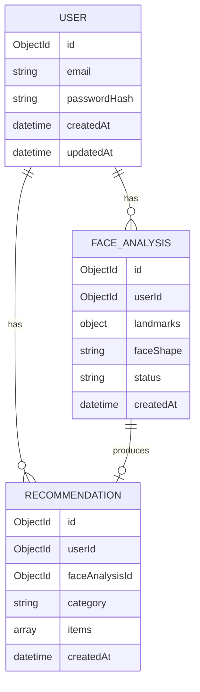

# Lumora — Database Design

| Field | Value |
|---|---|
| Status | Active source of truth (logical model) |
| Store | MongoDB |
| Owner | NestJS GraphQL backend |
| Related | [ARCHITECTURE.md](./ARCHITECTURE.md) · [API.md](./API.md) · [MVP.md](./MVP.md) · [SECURITY.md](./SECURITY.md) · [DECISIONS.md](./DECISIONS.md) |

---

## 1. Purpose

This document defines the MVP data model for Lumora in MongoDB: collections, ownership, relationships, and persistence rules.

Field-level types below are a **logical contract** for MVP. Exact Mongoose schemas may refine naming, but must preserve ownership and intent. Unconfirmed storage topics are listed in Section 9.

---

## 2. Database Principles

| Principle | Rule |
|---|---|
| Single writer | Only NestJS reads/writes MongoDB for product data |
| User isolation | History and recommendations are scoped to the owning user |
| AI is not the system of record | FastAPI does not own user or history collections |
| MVP minimalism | Store what the MVP needs; do not invent wardrobe/shopping collections |
| Privacy-aware | Face-related payloads are sensitive; retain only what product + security decisions require |

---

## 3. MVP Collections

```text
MongoDB
├── users
├── refresh_tokens          # optional — only if refresh-token auth is chosen
├── face_analyses
└── recommendations
```

| Collection | Purpose |
|---|---|
| `users` | Account identity and profile fields needed for auth/product |
| `face_analyses` | Stored analysis inputs/outputs for a scan session |
| `recommendations` | Hair recommendation results + history projection |
| `refresh_tokens` | Open — include only if token strategy requires server-side refresh storage |

---

## 4. Entity Relationship (Logical)



---

## 5. Collection Specifications

### 5.1 `users`

Supports MVP auth (ADR-009): email/password and Google OAuth only.

| Field | Type (logical) | Required | Notes |
|---|---|---|---|
| `_id` | ObjectId | Yes | Primary key |
| `email` | string | Conditional | Required for email/password; typically present for Google users |
| `passwordHash` | string | Conditional | Only for email/password users; never plaintext |
| `providers` | array\<object\> | Yes | Linked identities, e.g. `{ type: "google", subject: "..." }` |
| `displayName` | string | No | Optional profile label |
| `locale` | string | No | Preferred UI locale: `en` \| `ko` \| `uz` |
| `createdAt` | datetime | Yes | |
| `updatedAt` | datetime | Yes | |

**`providers[]` logical shape:**

| Field | Notes |
|---|---|
| `type` | `email` \| `google` |
| `subject` | Provider subject / unique id |
| `linkedAt` | datetime |

**Indexes (recommended):**

| Index | Fields | Reason |
|---|---|---|
| Unique sparse | `email` | Email login |
| Unique compound | `providers.type` + `providers.subject` | Google account linking |
| | `createdAt` | Ops / support queries |

### 5.2 `face_analyses`

Represents one analysis attempt/session for a user.

| Field | Type (logical) | Required | Notes |
|---|---|---|---|
| `_id` | ObjectId | Yes | |
| `userId` | ObjectId | Yes | Ref → `users` |
| `landmarks` | object / array | Conditional | MediaPipe landmark payload or normalized form |
| `faceShape` | string | Conditional | Set when AI succeeds |
| `rawAiResponse` | object | No | Optional debug/audit payload; avoid storing secrets |
| `status` | string enum | Yes | e.g. `pending`, `succeeded`, `failed` |
| `errorMessage` | string | No | Safe, user/ops-facing failure reason |
| `createdAt` | datetime | Yes | |
| `updatedAt` | datetime | Yes | |

**Indexes (recommended):**

| Index | Fields | Reason |
|---|---|---|
| Compound | `userId` + `createdAt` | User history timelines |
| | `status` | Operational filtering |

### 5.3 `recommendations`

MVP category is **hair**. Structure should allow future categories without a new architecture.

| Field | Type (logical) | Required | Notes |
|---|---|---|---|
| `_id` | ObjectId | Yes | |
| `userId` | ObjectId | Yes | Ref → `users` |
| `faceAnalysisId` | ObjectId | Yes | Ref → `face_analyses` |
| `category` | string | Yes | MVP value: `hair` |
| `faceShape` | string | Yes | Denormalized for fast history UI |
| `items` | array\<object\> | Yes | Recommendation entries from AI |
| `createdAt` | datetime | Yes | |

**`items[]` logical shape:**

| Field | Type | Notes |
|---|---|---|
| `id` or `key` | string | Stable recommendation identifier if available |
| `title` | string | Display name |
| `description` | string | Optional explanation |
| `score` | number | Optional confidence/rank |
| `metadata` | object | Optional extra attributes |

**Indexes (recommended):**

| Index | Fields | Reason |
|---|---|---|
| Compound | `userId` + `createdAt` | Recommendation history |
| | `faceAnalysisId` | Join-back to analysis |

### 5.4 `refresh_tokens` (optional)

Only if refresh-token persistence is chosen:

| Field | Type | Notes |
|---|---|---|
| `_id` | ObjectId | |
| `userId` | ObjectId | |
| `tokenHash` | string | Store hash, not raw token |
| `expiresAt` | datetime | |
| `createdAt` | datetime | |
| `revokedAt` | datetime | Nullable |

---

## 6. Persistence Rules

| Rule ID | Rule |
|---|---|
| DB-01 | NestJS persists successful recommendations used for history |
| DB-02 | Failed AI calls may persist a `face_analyses` row with `status=failed`, but must not mark recommendations as successful |
| DB-03 | All history queries filter by authenticated `userId` |
| DB-04 | Do not create wardrobe/outfit/shopping collections for MVP |
| DB-05 | Passwords are stored hashed only |
| DB-06 | Frontend and FastAPI do not write product collections directly |

---

## 7. Data Lifecycle (MVP)

```text
Scan submitted
  → create face_analyses (pending)
  → call FastAPI
  → update face_analyses (succeeded + faceShape) OR failed
  → on success: create recommendations (category=hair)
  → history reads recommendations by userId
```

**Retention (ADR-020):** face analyses and recommendations are kept until the **user account is deleted**. Account-deletion UX timing is OPEN-017.

Hairstyle catalog is **not** a MongoDB collection in MVP — it is **static JSON** in `lumora-ai` (ADR-021).

---

## 8. What Is Not Stored in MVP

| Data | MVP stance |
|---|---|
| Face images / camera frames | **Not stored** (landmarks-only, ADR-011) |
| Full raw camera video | Not stored |
| Wardrobe items | Out of scope |
| Chat messages | Out of scope |
| Shopping carts | Out of scope |
| Beard/glasses recommendation sets | Out of scope |

---

## 9. Open Database Decisions

| Decision | Status |
|---|---|
| Keep `rawAiResponse` in production | Open |
| Soft delete vs hard delete on account deletion | Open (OPEN-017 related) |
| MongoDB hosting (Atlas vs self-hosted) | Open |
| Mongoose vs native driver conventions | **Accepted (implementation):** NestJS + Mongoose |

---

## 10. Implementation Mapping (NestJS)

This section explains how the logical model above maps to code in `lumora-backend`.

| Logical collection | Mongoose class | File | MongoDB collection name |
|---|---|---|---|
| `users` | `User` (+ embedded `AuthProvider`) | `src/users/schemas/user.schema.ts` | `users` |
| `face_analyses` | `FaceAnalysis` | `src/face-analyses/schemas/face-analysis.schema.ts` | `face_analyses` |
| `recommendations` | `Recommendation` (+ embedded `RecommendationItem`) | `src/recommendations/schemas/recommendation.schema.ts` | `recommendations` |
| `refresh_tokens` | — | Not created | Deferred until OPEN-014 |

### Field notes (implementation)

| Topic | How it is implemented |
|---|---|
| Email uniqueness | Sparse unique index on `email` (Google-only users may omit email later, but MVP usually has one) |
| Google linking | Unique compound index on `providers.type` + `providers.subject` |
| Password safety | `passwordHash` uses `select: false`; never added to GraphQL `User` type |
| Landmarks | `Schema.Types` Mixed/`Object` until OPEN-004 freezes the MediaPipe point contract |
| Face shape | Shared TS enum `FaceShape` (ADR-012) used by Mongoose + GraphQL |
| Recommendation category | MongoDB stores wire value `hair`; GraphQL enum is `HAIR` |
| History indexes | `{ userId, createdAt: -1 }` on analyses and recommendations |
| Modules | `UsersModule`, `FaceAnalysesModule`, `RecommendationsModule` register schemas via `MongooseModule.forFeature` |

### What this phase does **not** include yet

- Auth services / JWT issuance (T-101)
- Writing analyses/recommendations from `analyzeFace` (T-105)
- History resolver logic (T-106)
- `refresh_tokens` collection (OPEN-014)

Env bootstrap: see root `.env.example` (`MONGODB_URI`).

---

## 11. Future Collections (Do Not Build Yet)

| Future feature | Likely future collections (illustrative) |
|---|---|
| Wardrobe | `wardrobe_items` |
| Outfit | `outfits` |
| Shopping | `products`, `orders` (if first-party) |
| Chat | `conversations`, `messages` |

These must not appear as MVP blockers.

---

## 12. Summary

MongoDB stores **users** (multi-provider identities), **face analyses** (landmarks + results), and **hair recommendations/history**, written only by NestJS. Data is retained until the user deletes it. Face images are not part of the MVP store. The model stays small, user-scoped, and ready for future recommendation categories. Mongoose schemas for the three MVP collections are implemented under `src/` (see Section 10).
