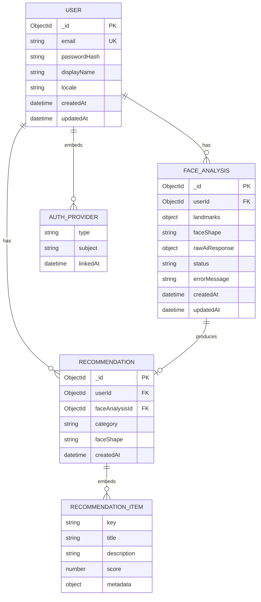

# Lumora — ER Modeling

| Field | Value |
|---|---|
| Status | Active source of truth (MVP ER) |
| Store | MongoDB |
| Implementation | NestJS + Mongoose (`src/**/schemas/`) |
| Related | [DATABASE.md](./DATABASE.md) · [API.md](./API.md) · [SCHEMA_AUDIT.md](./SCHEMA_AUDIT.md) · [DECISIONS.md](./DECISIONS.md) |

---

## 1. Purpose

Bu hujjat Lumora MVP **Entity-Relationship (ER) modeling** manbasi.

- Logical model (nima saqlanadi, qanday bog‘lanadi)
- Physical mapping (qaysi MongoDB collection / Mongoose class)
- Embedded vs referenced documents

Field-level API shakli uchun → [API.md](./API.md).  
Persistence rules uchun → [DATABASE.md](./DATABASE.md).

---

## 2. ER Diagram (Mermaid)



---

## 3. Relationship Map (ASCII)

```text
┌──────────────┐         1 : N         ┌─────────────────┐
│    USER      │──────────────────────▶│  FACE_ANALYSIS  │
│   users      │                       │  face_analyses  │
└──────┬───────┘                       └────────┬────────┘
       │                                        │
       │ 1 : N                                  │ 1 : 0..1
       │                                        │
       │               ┌────────────────────────▼────────┐
       └──────────────▶│         RECOMMENDATION          │
                       │        recommendations          │
                       └─────────────────────────────────┘
```

| Relationship | Cardinality | Meaning |
|---|---|---|
| User → FaceAnalysis | 1 : N | Bitta user ko‘p scan/analiz qiladi |
| FaceAnalysis → Recommendation | 1 : 0..1 | Muvaffaqiyatli analiz → bitta recommendation |
| User → Recommendation | 1 : N | History shu user’ga tegishli (user-scoped) |
| User → AuthProvider | 1 : N (embedded) | email / google identity linklari |
| Recommendation → RecommendationItem | 1 : N (embedded) | Hair catalog match itemlari |

---

## 4. Entities

### 4.1 USER (`users`)

| Field | Type | Required | Notes |
|---|---|---|---|
| `_id` | ObjectId | Yes | PK |
| `email` | string | Conditional | Unique sparse index |
| `passwordHash` | string | Conditional | Email auth only; never GraphQL |
| `providers[]` | AuthProvider[] | Yes | Embedded |
| `displayName` | string | No | |
| `locale` | `en` \| `ko` \| `uz` | No | ADR-016 |
| `createdAt` | datetime | Yes | |
| `updatedAt` | datetime | Yes | |

**Embedded AUTH_PROVIDER**

| Field | Type | Notes |
|---|---|---|
| `type` | `email` \| `google` | ADR-009 (no Kakao/phone) |
| `subject` | string | Provider unique id |
| `linkedAt` | datetime | |

**Indexes:** `email` unique sparse · `providers.type + providers.subject` unique · `createdAt`

**Code:** `src/users/schemas/user.schema.ts`

---

### 4.2 FACE_ANALYSIS (`face_analyses`)

| Field | Type | Required | Notes |
|---|---|---|---|
| `_id` | ObjectId | Yes | PK |
| `userId` | ObjectId | Yes | FK → `users` |
| `landmarks` | object | Conditional | MediaPipe JSON only (ADR-011) |
| `faceShape` | FaceShape enum | Conditional | Set on AI success |
| `rawAiResponse` | object | No | Optional audit |
| `status` | `pending` \| `succeeded` \| `failed` | Yes | |
| `errorMessage` | string | No | Safe message only |
| `createdAt` | datetime | Yes | |
| `updatedAt` | datetime | Yes | |

**FaceShape values (ADR-012):**  
`OVAL` · `ROUND` · `SQUARE` · `HEART` · `OBLONG` · `DIAMOND` · `TRIANGLE` · `OTHER`

**Indexes:** `{ userId, createdAt }` · `status`

**Code:** `src/face-analyses/schemas/face-analysis.schema.ts`

---

### 4.3 RECOMMENDATION (`recommendations`)

| Field | Type | Required | Notes |
|---|---|---|---|
| `_id` | ObjectId | Yes | PK |
| `userId` | ObjectId | Yes | FK → `users` |
| `faceAnalysisId` | ObjectId | Yes | FK → `face_analyses` |
| `category` | string | Yes | MVP: `hair` |
| `faceShape` | FaceShape enum | Yes | Denormalized for history UI |
| `items[]` | RecommendationItem[] | Yes | Embedded |
| `createdAt` | datetime | Yes | |

**Embedded RECOMMENDATION_ITEM**

| Field | Type | Notes |
|---|---|---|
| `key` | string? | Catalog key |
| `title` | string | Display name |
| `description` | string? | |
| `score` | number? | Rank/confidence |
| `metadata` | object? | Extra attributes |

**Indexes:** `{ userId, createdAt }` · `faceAnalysisId`

**Code:** `src/recommendations/schemas/recommendation.schema.ts`

---

## 5. Collection Inventory

| Collection | Entity | Kind |
|---|---|---|
| `users` | USER | Root document |
| `face_analyses` | FACE_ANALYSIS | Root document |
| `recommendations` | RECOMMENDATION | Root document |
| — | AUTH_PROVIDER | Embedded in USER |
| — | RECOMMENDATION_ITEM | Embedded in RECOMMENDATION |
| `refresh_tokens` | — | **Not modeled yet** (OPEN-014) |

---

## 6. What Is Intentionally Not Modeled (MVP)

| Entity / domain | Why |
|---|---|
| Face images / frames | ADR-011 landmarks-only |
| Hairstyle catalog collection | ADR-021 static JSON in AI |
| Wardrobe / Outfit / Shopping | Phase 2+ |
| Chat / Conversations | Phase 4 |
| Glasses / Beard recs | Phase 2 |

---

## 7. Lifecycle (how rows appear)

```text
register/login
  → USER (+ AUTH_PROVIDER)

analyzeFace (success path)
  → FACE_ANALYSIS (pending → succeeded + faceShape)
  → RECOMMENDATION (category=hair, items[])

analyzeFace (failure path)
  → FACE_ANALYSIS (failed + errorMessage)
  → no successful RECOMMENDATION

history
  → read RECOMMENDATION by authenticated userId
```

---

## 8. Comparison Note (Gadjet-Store style)

Gadjet-Store backend’da root Mongoose models `src/schema/*.model.ts` ko‘rinishida yuritiladi  
(Member / Product / Order / OrderItem / View).

Lumora’da domain bo‘yicha ajratilgan:

```text
src/users/schemas/user.schema.ts
src/face-analyses/schemas/face-analysis.schema.ts
src/recommendations/schemas/recommendation.schema.ts
```

ER modeling manbasi shu fayl (`docs/ER_MODELING.md`). Model o‘zgarsa — diagram + jadval shu yerda yangilanadi.

---

## 9. Summary

MVP ER modeli kichik va aniq:

```text
USER
 ├─ embeds AUTH_PROVIDER[]
 ├─ has FACE_ANALYSIS[]
 └─ has RECOMMENDATION[]
      ├─ refs FACE_ANALYSIS
      └─ embeds RECOMMENDATION_ITEM[]
```

Keyingi backend qadam (Auth T-101) shu ER ustiga yoziladi — yangi collection qo‘shilmaydi (refresh tokens ochiq bo‘lsa alohida ADR).
