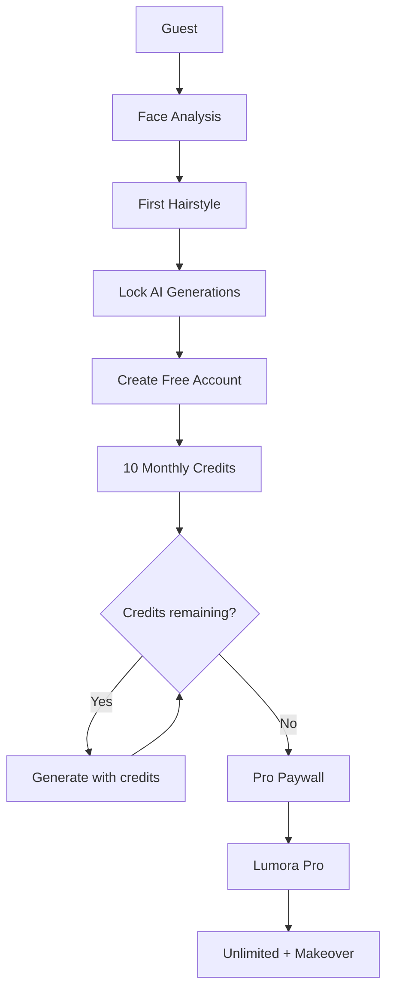

# Lumora — Monetization & Access Strategy

| Field | Value |
|---|---|
| Status | Accepted product strategy (post-MVP) |
| Related | [PROJECT.md](./PROJECT.md) · [MVP.md](./MVP.md) · [ROADMAP.md](./ROADMAP.md) · [DECISIONS.md](./DECISIONS.md) · [DATABASE.md](./DATABASE.md) · [API.md](./API.md) |
| ADR | ADR-022 |

---

## 1. Purpose

This document defines Lumora’s **access tiers**, **credit system**, **conversion funnel**, and **paywall messaging**.

It is the product source of truth for monetization. Implementation timing is **post-MVP** (see Section 9 and [ROADMAP.md](./ROADMAP.md)). MVP still ships the authenticated hair pipeline without payment (ADR-007).

---

## 2. Strategy Goal

Do **not** force payment on first contact. Convert through experience:

```text
Guest → Free Account → Pro Subscription
```

| Stage | Intent |
|---|---|
| Guest | Experience AI quality with zero commitment |
| Free Account | Invest via signup; spend monthly credits |
| Lumora Pro | Unlimited access + premium features |

Users should feel the value of Lumora’s AI **before** registration, then upgrade when free credits run out.

---

## 3. Access Tiers

### 3.1 Guest (not signed in)

**Available**

| Capability | Limit |
|---|---|
| Face analysis | Yes (one session) |
| Face shape detection | Yes |
| Skin tone analysis | Yes (when that feature exists) |
| Hair recommendation | **One** generated hairstyle only |

**Restricted**

| Capability | Guest |
|---|---|
| Second hairstyle generation | Locked |
| Glasses / beard / hat / outfit recommendations | Locked |
| Download / export | Locked |
| History | Locked |
| Favorites | Locked |
| Regeneration | Locked |

After the first hairstyle is generated, **all further AI generation features lock**.

**Guest paywall (account conversion)**

```text
✨ Your first AI recommendation is ready!

Want to explore hundreds of hairstyles, glasses, beard styles,
outfits and more?

Create a free account to continue.

[ Create Free Account ]
```

Purpose: prove AI quality, then ask for registration — not payment.

### 3.2 Free Account

Once registered, the user receives a monthly pool of **AI Credits**.

| Rule | Value |
|---|---|
| Monthly grant | **10 Free AI Credits** |
| Model | Unified credit wallet (not per-feature hard caps) |
| History | Yes |
| Favorites | Yes |
| Watermark / HD export | Free tier may remain limited (see Pro) |

**Credit costs**

| Action | Credits |
|---|---|
| Hair Style | 1 |
| Glasses | 1 |
| Beard | 1 |
| Hat | 1 |
| Color Palette | 1 |
| Outfit Recommendation | 2 |
| Complete AI Makeover | **Pro-only** (see Section 5) |

Example wallet flow:

```text
User Credits: 10
  Generate Hair     → 10 → 9
  Generate Glasses  →  9 → 8
  ...
```

When `credits == 0`, show the Pro paywall (Section 6).

### 3.3 Lumora Pro

Pro removes generation limits and unlocks premium capabilities.

| Benefit | Detail |
|---|---|
| Unlimited AI Credits | No monthly generation cap |
| Unlimited generations | Hair, glasses, beard, hat, outfit, color palette |
| AI Complete Makeover | Flagship Pro feature (Section 5) |
| HD Image Export | Yes |
| No Watermark | Yes |
| History / Favorites / Save Looks | Yes |
| Fast Generation Queue | Priority processing |
| Access to new AI models | Yes |

---

## 4. Plan Comparison

| Capability | Guest | Free | Pro |
|---|---|---|---|
| Account required | No | Yes | Yes |
| Face analysis | 1 session | Credit / included | Unlimited |
| Hair style preview | **1 only** | 1 credit each | Unlimited |
| Glasses / beard / hat | No | 1 credit each | Unlimited |
| Outfit recommendation | No | 2 credits | Unlimited |
| Color palette | No | 1 credit | Unlimited |
| Complete Makeover | No | No | Unlimited |
| History | No | Yes | Yes |
| Favorites / Save Looks | No | Yes | Yes |
| HD download | No | Limited / no | Yes |
| Watermark-free | No | No | Yes |
| Priority AI queue | No | No | Yes |

---

## 5. Premium Flagship — AI Complete Makeover

**Pro-exclusive.** One action generates a full personalized appearance:

- Hairstyle
- Beard
- Glasses
- Hat
- Outfit
- Clothing color palette

**CTA:** `✨ Generate Complete Makeover`

This is the highest perceived-value product surface and must not be available on Guest or Free.

---

## 6. Conversion Funnel & Paywalls

### 6.1 Funnel

```text
Guest
  → Face analysis
  → Generate first hairstyle
  → Everything locked
  → Create Free Account
  → Receive 10 Free Credits
  → Use credits
  → Credits = 0
  → Upgrade to Lumora Pro
  → Unlimited AI access
```



### 6.2 Free → Pro paywall copy

Do not say only “Upgrade to Pro.” State concrete gains:

```text
You've used all your free AI generations.

Unlock Lumora Pro

✓ Unlimited Hairstyles
✓ Unlimited Glasses
✓ Unlimited Beard Styles
✓ Unlimited Outfit Recommendations
✓ AI Complete Makeover
✓ HD Downloads
✓ Save Your Favorite Looks
✓ Faster AI Processing

[ Upgrade to Lumora Pro ]
```

---

## 7. Why Credits (Not Per-Feature Caps)

| Advantage | Detail |
|---|---|
| Easier to manage | One wallet, one balance |
| Scalable | New AI features only need a cost row |
| Simpler backend | Debit/credit ledger vs many counters |
| Pricing flexibility | Change costs without new plan tiers |
| Clearer UX | User sees one number |

**Future cost examples** (no subscription architecture change required):

| Feature | Credits |
|---|---|
| AI Hair Color | 1 |
| AI Makeup | 2 |
| AI Accessories | 1 |
| AI Fashion Styling | 2 |
| AI Seasonal Outfit | 2 |
| AI Wedding Look | 3 |
| AI Business Style | 2 |
| AI Celebrity Look | 3 |

---

## 8. Engineering Implications (When Built)

These are design targets for post-MVP implementation — not MVP requirements.

### 8.1 Access model (important)

**Guest is not a `User` row.** Guests are unauthenticated. Do **not** model `UserType = GUEST | USER | PRO`.

| Concept | Where it lives | Values |
|---|---|---|
| **AccessTier** (runtime) | Derived by NestJS from auth + plan | `GUEST` \| `FREE` \| `PRO` |
| **UserPlan** (persisted) | On authenticated `users` document | `FREE` \| `PRO` |

```text
No JWT / no account     → AccessTier.GUEST
Signed in, plan=FREE    → AccessTier.FREE
Signed in, plan=PRO     → AccessTier.PRO  (active subscription)
```

```graphql
# Post-MVP GraphQL (logical contract)
enum UserPlan {
  FREE
  PRO
}

enum AccessTier {
  GUEST
  FREE
  PRO
}

type User {
  id: ID!
  email: String
  displayName: String
  plan: UserPlan!          # FREE by default after register
  creditsRemaining: Int    # null/omit for PRO (unlimited)
  createdAt: DateTime!
}
```

| Wrong | Right |
|---|---|
| `enum UserType { GUEST USER PRO_USER }` on User | `plan: UserPlan` on User; Guest has **no** User |
| Storing guest as a fake user | Ephemeral guest session id + rate limits |
| Client-sent `plan` | NestJS derives entitlements from DB + subscription |

### 8.2 Other expectations

| Area | Expectation |
|---|---|
| Access control | NestJS resolves `AccessTier` before calling FastAPI |
| Credits | Server-side ledger; never trust client-reported balance |
| Guest session | Ephemeral guest id / device session for one preview |
| Idempotency | Debit credits only after successful generation (or clear refund rules) |
| Pro entitlements | Active `subscriptions` row → `plan=PRO` / unlimited |
| Paywalls | Frontend renders copy from Section 6; backend returns structured lock reasons (`GUEST_LIMIT`, `CREDITS_EXHAUSTED`, `PRO_REQUIRED`) |
| Data model | `users.plan`, `credit_wallets`, `credit_transactions`, `subscriptions` (see [DATABASE.md](./DATABASE.md)) |

Hard rule unchanged: **Frontend never calls FastAPI** (ADR-004). Monetization gates live in NestJS.

---

## 9. MVP Alignment & Analysis

### 9.1 What this strategy accepts as product direction

| Decision | Status |
|---|---|
| Freemium funnel Guest → Free → Pro | Accepted (ADR-022) |
| Unified monthly credit system for Free | Accepted |
| `UserPlan` = `FREE` \| `PRO` on accounts; Guest ≠ User row | Accepted |
| Complete Makeover = Pro-only flagship | Accepted |
| Benefit-led paywall messaging | Accepted |
| Credit costs for future features | Accepted pattern |

### 9.2 Phase placement

| Phase | Monetization |
|---|---|
| Phase 1 — MVP | **No payments / credits.** Authenticated users get the MVP hair flow (ADR-007). Guest preview may be a fast-follow UX choice but is not required to call MVP done. |
| Phase 2+ / Growth | Implement Guest limits, Free credits, Pro subscription, Makeover, HD export |

MVP.md still lists “Payment / subscriptions” as out of MVP. That remains correct until monetization work is scheduled via [ROADMAP.md](./ROADMAP.md).

### 9.3 Conflicts & reconciliations with existing docs

| Strategy draft wording | Current Lumora decision | Reconciliation |
|---|---|---|
| “Upload one selfie” | ADR-011: **landmarks-only**; no face image to backend/AI | Guest preview uses the **same guided scan + landmarks** pipeline. Do not reintroduce selfie upload without a new ADR. |
| Glasses / beard / outfit / hat / makeover | Out of MVP; Phase 2–3 on roadmap | Monetization **gates** those features when they ship; it does not pull them into MVP. |
| History / Favorites on Free | History is MVP for authenticated users; Favorites post-MVP | Keep history for Free/Pro when accounts exist; Favorites when productized. |
| HD export / watermark | Not in MVP | Pro entitlement when export exists. |
| Skin tone analysis | Deferred with color analysis | Guest “skin tone” applies only after that capability exists. |

### 9.4 Product analysis (strategy quality)

| Strength | Why it fits Lumora |
|---|---|
| Experience-first guest | Matches “prove AI quality” before signup |
| Single credit wallet | Fits NestJS orchestration + future feature expansion |
| Makeover as Pro hero | Clear differentiation and upgrade motivation |
| Explicit paywall benefits | Reduces vague “go Pro” friction |

| Risk | Mitigation |
|---|---|
| Guest one-shot feels too thin | Ensure first hair rec quality is high; copy emphasizes “hundreds more” after account |
| Free 10 credits too low/high | Treat `10` and cost table as tunable config, not hard-coded forever |
| Complete Makeover cost vs Free | Keep Makeover Pro-only; do not sell it for Free credits |
| Abuse (guest reset / multi-account) | Rate-limit guests; fraud signals; Pro value must exceed Free grind |

---

## 10. Recommended Plans (Canonical Summary)

### Guest

- No account required
- 1 hair style preview
- Face analysis (+ skin tone when available)
- Post-preview lock → Create Free Account

### Free

- 10 AI Credits / month
- Credit-based generation
- History
- Favorites (when shipped)

### Pro

- Unlimited AI Credits
- Unlimited generations
- AI Complete Makeover
- HD downloads
- Watermark-free images
- Priority processing
- Access to current and future AI styling features

---

## 11. Change Control

- Credit amounts, costs, and plan entitlements change in **this file** first
- Architecture/product binding decisions also update [DECISIONS.md](./DECISIONS.md)
- Do not silently move monetization into MVP without updating [MVP.md](./MVP.md) and ADR-007 / ADR-022 consequences
- New AI features only need a credit cost row (Section 7) unless they change Pro exclusivity

---

## 12. Summary

Lumora monetizes with a **Guest → Free (10 monthly credits) → Pro** funnel. Guests get one hair preview; Free users spend a unified credit wallet; Pro unlocks unlimited generations, priority processing, HD/watermark-free export, and the **AI Complete Makeover**. The strategy is accepted product direction and ships **after** the MVP hair pipeline.
