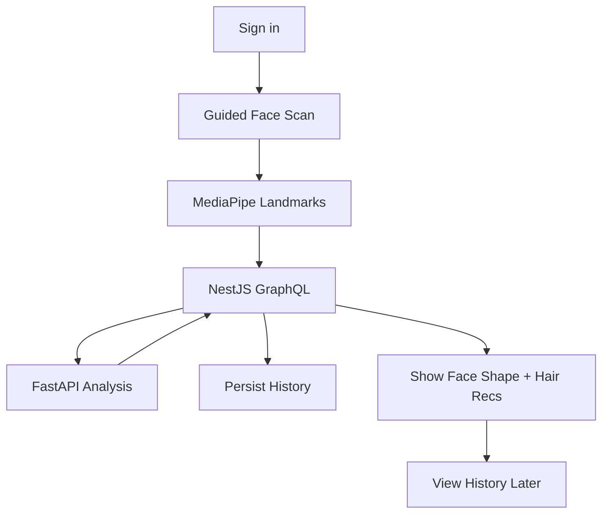

# Lumora — MVP Definition

| Field | Value |
|---|---|
| Status | Active source of truth |
| Related | [PROJECT.md](./PROJECT.md) · [ARCHITECTURE.md](./ARCHITECTURE.md) · [ROADMAP.md](./ROADMAP.md) · [MONETIZATION.md](./MONETIZATION.md) · [TASKS.md](./TASKS.md) · [PROGRESS.md](./PROGRESS.md) |

---

## 1. Purpose

This document defines what “MVP done” means for Lumora: included capabilities, acceptance criteria, explicit exclusions, and delivery boundaries.

If a feature is not listed here as in-scope, it is **not** MVP work.

---

## 2. MVP Statement

Deliver an authenticated product flow where a user completes a **guided face scan**, the system derives **MediaPipe face landmarks**, NestJS orchestrates **FastAPI face analysis**, and the user receives **face shape detection** plus **hair recommendations**, with results available in **recommendation history**.

**Tagline alignment:** Scan. Analyze. Transform.  
**MVP slice:** Scan → Analyze → Hair recommendation (history included).

---

## 3. In-Scope Capabilities

| ID | Capability | Primary owner |
|---|---|---|
| MVP-01 | Authentication | Backend + Frontend |
| MVP-02 | Guided Face Scan | Frontend |
| MVP-03 | MediaPipe Face Landmarks | Frontend |
| MVP-04 | Face Shape Detection | AI + Backend orchestration |
| MVP-05 | Hair Recommendation | AI + Backend orchestration |
| MVP-06 | Recommendation History | Backend + Frontend |

---

## 4. Acceptance Criteria

### MVP-01 — Authentication

- [ ] Email + password register/login works
- [ ] Google OAuth login works
- [ ] Protected GraphQL operations require `Authorization: Bearer <JWT>`
- [ ] Signed-in users can access scan and history flows
- [ ] Kakao and Phone OTP are **not** required (out of MVP)

See ADR-009 and ADR-010.

### MVP-02 — Guided Face Scan

- [ ] Frontend provides a guided scan experience (clear steps / instructions)
- [ ] User can complete a scan session intended for landmark extraction
- [ ] Failed or unusable capture can be retried in the UI

### MVP-03 — MediaPipe Face Landmarks

- [ ] MediaPipe runs in the frontend during the scan flow
- [ ] Landmark data is produced client-side
- [ ] **Landmarks-only** payload is sent to NestJS GraphQL — not images, and not to FastAPI (ADR-011)

### MVP-04 — Face Shape Detection

- [ ] NestJS forwards analysis input to FastAPI
- [ ] FastAPI returns a face shape result
- [ ] Frontend displays the face shape to the authenticated user

### MVP-05 — Hair Recommendation

- [ ] Hybrid engine returns men-focused hair recommendations matched to **static JSON** catalog (ADR-013, ADR-014, ADR-021)
- [ ] NestJS returns those recommendations through GraphQL
- [ ] Frontend displays recommendations to the user (i18n-ready for `en` / `ko` / `uz`)

### MVP-06 — Recommendation History

- [ ] Successful recommendation results are persisted by NestJS in MongoDB
- [ ] Authenticated user can retrieve their prior recommendations
- [ ] History is user-scoped (users do not see other users’ history)

---

## 5. End-to-End MVP Scenario

```text
1. User signs up / signs in
2. User starts guided face scan
3. Frontend extracts MediaPipe landmarks
4. Frontend calls NestJS GraphQL with scan/landmark payload
5. NestJS calls FastAPI
6. FastAPI returns face shape + hair recommendations
7. NestJS persists history and returns results
8. User views results
9. User later opens history and sees prior results
```



---

## 6. Explicitly Out of Scope

Do not implement these as MVP requirements:

| Feature | Status |
|---|---|
| Glasses recommendation | Future |
| Beard recommendation | Future |
| Outfit recommendation | Future |
| Wardrobe | Future |
| Shopping | Future |
| Virtual try-on | Future |
| Chat | Future |
| Color analysis | Future |

Also out of MVP unless separately decided:

- Admin dashboards
- Payment / subscriptions / AI credits (accepted strategy in [MONETIZATION.md](./MONETIZATION.md); ships post-MVP per ADR-022)
- Social sharing
- Multi-language productization (not decided)
- Generative AI image creation as a core loop

---

## 7. Quality Bar for MVP

| Area | Minimum bar |
|---|---|
| Architecture compliance | Frontend never calls FastAPI |
| Security | Auth protects analysis and history |
| Reliability | AI/backend failures surface as controlled errors |
| UX | Guided scan is usable end-to-end on supported browsers (support matrix open) |
| Data | History survives refresh / re-login for the same user |

---

## 8. Definition of Done (MVP Release)

MVP is done when **all** of the following are true:

1. All acceptance criteria in Section 4 are checked
2. The end-to-end scenario in Section 5 works in a local (or deployed) environment with real NestJS ↔ FastAPI integration
3. No out-of-scope feature is required to demo the product
4. Docs in `docs/` still match shipped behavior (update if behavior changed via [DECISIONS.md](./DECISIONS.md))

---

## 9. Non-Goals Inside MVP Engineering

| Non-goal | Why |
|---|---|
| Perfect model accuracy | MVP proves the pipeline; model quality iterates |
| Full design-system polish | Usable > perfect |
| Premature microservices | Keep three confirmed surfaces |
| Inventing Redis/queues “just in case” | Not confirmed architecture |

---

## 10. Tracking

| Artifact | Role |
|---|---|
| [TASKS.md](./TASKS.md) | Breakdown of implementation work |
| [PROGRESS.md](./PROGRESS.md) | What is complete vs in progress |
| [ROADMAP.md](./ROADMAP.md) | What comes after MVP |

---

## 11. Summary

Lumora MVP is a thin vertical slice: **authenticate → guided scan → MediaPipe landmarks → NestJS → FastAPI → face shape + hair recommendations → history**. Everything else waits.
