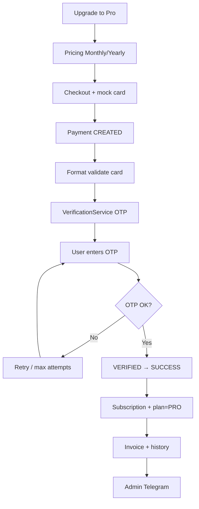

# Lumora — Mock Payment Workflow

| Field | Value |
|---|---|
| Status | Accepted product strategy (monetization / Phase 2b) |
| Related | [MONETIZATION.md](./MONETIZATION.md) · [VERIFICATION.md](./VERIFICATION.md) · [DATABASE.md](./DATABASE.md) · [SECURITY.md](./SECURITY.md) · [ROADMAP.md](./ROADMAP.md) · [DECISIONS.md](./DECISIONS.md) |
| ADR | ADR-023 |

---

## 1. Purpose

Define Lumora’s **complete mock payment workflow** for Pro checkout: checkout UI → card capture → OTP verification → subscription activation → invoice → admin notification.

No real bank or payment gateway is used. The flow must **resemble** a real SaaS subscription system so `MockPaymentProvider` can later be swapped for Stripe, Toss Payments, KakaoPay, or PayPal **without changing business logic**.

**Phase note:** Core hair MVP (ADR-007) stays payment-free. This document is the **monetization MVP** (Phase 2b / ADR-022–023). Do not block Phase 1 on payments.

---

## 2. Goals

| Goal | Detail |
|---|---|
| Portfolio-ready demo | Full checkout + OTP + Pro activation without real money |
| Provider-agnostic domain | Subscription / invoice / plan logic independent of Mock vs Stripe |
| Shared verification | OTP uses [VERIFICATION.md](./VERIFICATION.md) — not a payment-only OTP path |
| Ops visibility | Admin Telegram alert on successful Pro payment |

---

## 3. End-to-End Workflow

```text
Guest / Free user
  → Uses free features
  → Clicks "Upgrade to Pro"
  → Pricing page (Monthly | Yearly)
  → Continue to Checkout
  → Enter card fields (mock)
  → Pay Now
  → Backend: Payment record Status = CREATED
  → Basic card validation (format only — not a bank)
  → Generate 6-digit OTP via VerificationService
  → Route OTP by auth provider (email / Google email / …)
  → Verification screen
  → User enters OTP
  → Backend verifies OTP
      → fail: error, retry, max attempts
      → success: CREATED → PENDING_VERIFICATION → VERIFIED → SUCCESS
  → Create Subscription
  → Activate Pro (users.plan = PRO)
  → Grant unlimited credits
  → Save payment history + invoice
  → Success response to client
  → Admin Telegram notification
  → Payment completed
```



---

## 4. Checkout UI (Mock Card)

Collect (mock only — never send to a real PSP):

| Field | Notes |
|---|---|
| Cardholder name | Required |
| Card number | Luhn/format check optional; **not** bank auth |
| Expiration date | Format + not expired (soft check) |
| CVV | Length check only |

**Rules**

- Do **not** persist full PAN/CVV in MongoDB (store last4 + brand only if needed for display)
- Mock provider may accept any well-formed test card (document test numbers in `.env.example` / DEV notes)
- Real gateway later: same UI fields map to provider tokenization; server never needs raw PAN if using hosted fields

---

## 5. Payment Status Machine

| Status | Meaning |
|---|---|
| `CREATED` | Checkout submitted; record created |
| `PENDING_VERIFICATION` | OTP issued; awaiting confirm |
| `VERIFIED` | OTP accepted |
| `SUCCESS` | Subscription activated; money “captured” (mock) |
| `FAILED` | Validation / OTP exhausted / cancelled |
| `CANCELLED` | User cancelled verification |

Happy path:

```text
CREATED → PENDING_VERIFICATION → VERIFIED → SUCCESS
```

---

## 6. Plans & Pricing (Logical)

| Plan code | Billing period | Notes |
|---|---|---|
| `PRO_MONTHLY` | Monthly | Amount configurable (e.g. `$9.99`) |
| `PRO_YEARLY` | Yearly | Amount configurable |

Exact prices remain product config (OPEN-018). Workflow does not hard-code UI strings in the domain layer.

On `SUCCESS`:

1. Create / activate `subscriptions` row
2. Set `users.plan = PRO`
3. Treat credits as **unlimited** for Pro (no debit for generations)
4. Persist payment history + invoice

---

## 7. Service Boundaries (Clean Architecture)

```text
PaymentService
  → orchestrates checkout + status transitions
  → calls PaymentProvider (Mock | Stripe | …)
  → publishes domain events

VerificationService     ← shared (see VERIFICATION.md)
NotificationService     ← email / Telegram / future channels
SubscriptionService
InvoiceService
```

| Service | Responsibility |
|---|---|
| **PaymentService** | Create payment, validate mock card, drive status, call provider abstraction |
| **PaymentProvider** | `MockPaymentProvider` now; Stripe/Toss/etc. later |
| **VerificationService** | OTP create / send / verify (purpose = `PAYMENT`) |
| **SubscriptionService** | Activate/cancel Pro; sync `users.plan` |
| **InvoiceService** | Invoice records for history |
| **NotificationService** | User-facing + **admin Telegram** on success |

**Hard rule:** `PaymentService` must **never** send email, Telegram, SMS, or OTP itself. It publishes events (or calls ports) handled by dedicated services.

---

## 8. Provider Abstraction (Future Migration)

```text
IPaymentProvider
  ├── MockPaymentProvider      ← MVP monetization
  ├── StripePaymentProvider    ← future
  ├── TossPaymentProvider      ← future
  ├── KakaoPayProvider         ← future
  └── PayPalPaymentProvider    ← future
```

**Must stay stable when swapping providers**

- Checkout UI flow
- Payment workflow / status machine
- Subscription logic
- OTP verification (if still required)
- Notification system
- Billing history + invoices
- User plan management (`FREE` \| `PRO`)

Only the **PaymentProvider implementation** (+ webhook handling for real PSPs) should change.

---

## 9. OTP for Payment

Uses shared [VERIFICATION.md](./VERIFICATION.md):

| Rule | Value |
|---|---|
| Length | 6 digits |
| Expiry | 2 minutes |
| Max attempts | 5 |
| Active OTPs | One per user+purpose |
| Resend | Invalidates previous OTP |

**Routing by auth provider** (MVP + future):

| Auth provider | OTP destination |
|---|---|
| Email/password | User email |
| Google OAuth | Google account email |
| Telegram login | Telegram bot (**future** login) |
| Phone | SMS (**future**) |
| Apple | Apple email (**future**) |
| Kakao | Kakao message (**future**) |

MVP auth is **email + Google only** (ADR-009). Admin Telegram notification is an **ops channel**, not a login provider.

Verification UI copy:

```text
Payment Verification

Enter the 6-digit verification code.

[ _ _ _ _ _ _ ]

Resend Code
Cancel
Confirm
```

---

## 10. Administrator Telegram Notification

On `SUCCESS`, send immediately via `NotificationService`:

```text
━━━━━━━━━━━━━━━━━━━━
💳 NEW PRO SUBSCRIPTION

User:
John Doe

User ID:
USR_10291

Plan:
Pro Monthly

Amount:
$9.99

Authentication:
Google OAuth

Identifier:
john@gmail.com

Verification:
Google Email

Payment Status:
SUCCESS

Time:
2026-07-21 17:15 KST
━━━━━━━━━━━━━━━━━━━━
```

---

## 11. Data Model (Logical — Post Phase 1)

| Collection | Purpose |
|---|---|
| `payments` | Checkout attempts + status + amount + plan code + last4 |
| `subscriptions` | Active/cancelled Pro periods |
| `invoices` | Billing artifacts |
| `verification_challenges` | Shared OTP store (see VERIFICATION.md) |
| `users.plan` | `FREE` \| `PRO` |

Do not store raw card number or CVV.

---

## 12. GraphQL / API Surface (Logical)

Illustrative — finalize in [API.md](./API.md) when implementing:

| Operation | Auth | Purpose |
|---|---|---|
| `pricingPlans` | Public / auth | Monthly & yearly Pro plans |
| `createPaymentCheckout` | Required | Start mock payment → `CREATED` |
| `confirmPaymentVerification` | Required | Submit OTP |
| `resendPaymentVerification` | Required | New OTP |
| `mySubscription` | Required | Current plan / period |
| `myInvoices` / `myPayments` | Required | History |

Lock reasons / errors should align with monetization paywalls (`PRO_REQUIRED`, etc.).

---

## 13. Analysis & Reconciliations

| Draft idea | Lumora decision |
|---|---|
| “MVP includes mock payment” | **Monetization MVP (Phase 2b)** — not Phase 1 hair MVP (ADR-007) |
| Telegram / Kakao / Phone OTP destinations | Supported in **VerificationService** design; login providers remain out of Phase 1 (ADR-009) |
| Real bank validation | Rejected for mock; format-only |
| PaymentService sends Telegram | Rejected — `NotificationService` only |
| Guest pays | Checkout requires authenticated Free (or signed-in) user; Guest still hits “Create Free Account” first per [MONETIZATION.md](./MONETIZATION.md) |

---

## 14. Change Control

- Workflow / status / provider boundary changes update this file + [DECISIONS.md](./DECISIONS.md)
- OTP rules live in [VERIFICATION.md](./VERIFICATION.md) (single source)
- Pricing amounts: config + OPEN-018

---

## 15. Summary

Lumora’s monetization checkout is a **full mock SaaS payment loop**: pricing → mock card → shared OTP → Pro subscription → invoice → admin Telegram. Domain services stay provider-agnostic so Stripe/Toss/KakaoPay/PayPal can replace `MockPaymentProvider` later without rewriting subscription or plan logic.
