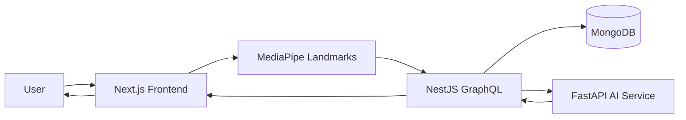

# Lumora — Project Definition

**Scan. Analyze. Transform.**

| Field | Value |
|---|---|
| Product name | Lumora |
| Category | AI Personal Stylist platform |
| Documentation status | Active source of truth |
| Related | [Architecture](./ARCHITECTURE.md) · [MVP](./MVP.md) · [Roadmap](./ROADMAP.md) · [Decisions](./DECISIONS.md) |

---

## 1. Purpose

This document defines the Lumora product at a level suitable for engineering, product, and design alignment.

It answers:

- What Lumora is
- What Lumora is not
- How the core user journey works
- What is in MVP
- What is explicitly deferred
- How this document relates to the rest of `docs/`

Implementation details belong in specialized documents. This file owns **product identity and scope**.

---

## 2. Product Summary

Lumora is an AI Personal Stylist platform.

Users complete a guided face scan. The system extracts facial landmarks, analyzes face characteristics, and returns personalized styling recommendations. The MVP focuses on **face shape detection** and **hair recommendation**, with persisted **recommendation history**.

Lumora is a recommendation and analysis product, not a generative media product.

### MVP audience & experience

| Topic | Decision |
|---|---|
| Audience | **Men** (ADR-014) |
| Client | Responsive **web + mobile web** (ADR-015) |
| Languages | English, Korean, Uzbek (ADR-016) |
| Analyze payload | MediaPipe **landmarks only** (ADR-011) |
| Hair engine | **Hybrid** catalog + ranking/explanation (ADR-013) |

---

## 3. What Lumora Is Not

| Non-goal | Clarification |
|---|---|
| AI image generator | Lumora does not generate synthetic face or style images as its core product loop |
| Direct-to-AI client | The frontend never calls the AI service directly |
| Full styling suite at launch | Glasses, beard, outfit, wardrobe, shopping, try-on, chat, and color analysis are future work |

Historical names and brainstorming (including StyleAI materials) are **not** authoritative when they conflict with Lumora decisions.

---

## 4. Core User Journey

```text
User
  → Guided Face Scan
  → MediaPipe Face Landmarks
  → NestJS GraphQL Backend
  → FastAPI AI Service
  → Face Analysis
  → Personalized Recommendations
```

### Journey stages

| Stage | Owner | Outcome |
|---|---|---|
| Guided Face Scan | Frontend (Next.js) | User completes a structured capture flow |
| MediaPipe Face Landmarks | Frontend (MediaPipe) | Landmark data extracted on the client |
| NestJS GraphQL Backend | Backend | Auth, validation, orchestration, persistence |
| FastAPI AI Service | AI service | Face analysis and recommendation inference |
| Personalized Recommendations | Backend → Frontend | Results returned to the user; history stored |



---

## 5. Platform Shape

Lumora uses **multi-repo** (not monorepo) with three primary surfaces:

| Surface | Repository | Technology | Role |
|---|---|---|---|
| Frontend | `lumora-frontend` | Next.js | Scan UX, MediaPipe, UI |
| Backend | `lumora-backend` | NestJS, GraphQL, MongoDB | Auth, orchestration, data |
| AI Service | `lumora-ai` | FastAPI (Python) | Face analysis + hybrid hair recs |

### Hard communication rule

```text
Frontend → NestJS GraphQL → FastAPI AI
```

- Frontend **must not** call FastAPI directly
- NestJS is the only public application API for clients
- FastAPI is internal; production calls use `X-API-KEY` (ADR-019)

See [ARCHITECTURE.md](./ARCHITECTURE.md) and [MONOREPO.md](./MONOREPO.md).

---

## 6. MVP Scope

The current MVP includes only the following capabilities:

| Capability | Description |
|---|---|
| Authentication | Email/password + Google OAuth; JWT Bearer (ADR-009, ADR-010). Phone/Kakao out of MVP |
| Guided Face Scan | Frontend leads the user through a usable scan flow |
| MediaPipe Face Landmarks | Client extracts facial landmarks |
| Face Shape Detection | System classifies face shape from analysis inputs |
| Hair Recommendation | System returns personalized hair recommendations |
| Recommendation History | Users can view prior recommendation results |

MVP acceptance criteria and delivery breakdown are owned by [MVP.md](./MVP.md).

---

## 7. Explicitly Out of Scope (Post-MVP)

The following are planned product directions, **not** MVP deliverables:

- Glasses recommendation
- Beard recommendation
- Outfit recommendation
- Wardrobe
- Shopping
- Virtual try-on
- Chat
- Color analysis

Sequencing and priorities are owned by [ROADMAP.md](./ROADMAP.md).

---

## 8. Product Principles

| Principle | Meaning |
|---|---|
| Analysis over generation | Prefer measurable face analysis and ranked recommendations over generative imagery as the core loop |
| Guided capture | Scan quality is a product concern; the UX must help users produce usable inputs |
| Backend-mediated AI | All AI calls are owned by NestJS; clients never hold AI-service trust boundaries |
| Scope discipline | Ship face shape + hair + history before expanding into wardrobe, shopping, or try-on |
| Decision clarity | When docs conflict, latest Lumora decisions win; record them in [DECISIONS.md](./DECISIONS.md) |

---

## 9. Repository Context

This documentation set describes the **Lumora platform**.

Per ADR-018:

| Repo | Role |
|---|---|
| `lumora-backend` (this repo) | NestJS GraphQL + these docs |
| `lumora-frontend` | Next.js |
| `lumora-ai` | FastAPI |

Monorepo is not used.

| Concern | Document |
|---|---|
| System design | [ARCHITECTURE.md](./ARCHITECTURE.md) |
| Repo / package layout | [MONOREPO.md](./MONOREPO.md) |
| GraphQL / API contracts | [API.md](./API.md) |
| AI service behavior | [AI.md](./AI.md) |
| Data model | [DATABASE.md](./DATABASE.md) |
| Security expectations | [SECURITY.md](./SECURITY.md) |

---

## 10. Documentation Map

| Document | Responsibility |
|---|---|
| [PROJECT.md](./PROJECT.md) | Product identity, journey, MVP vs future |
| [ARCHITECTURE.md](./ARCHITECTURE.md) | Runtime architecture and boundaries |
| [MONOREPO.md](./MONOREPO.md) | Monorepo structure and ownership |
| [MVP.md](./MVP.md) | MVP scope and acceptance |
| [DATABASE.md](./DATABASE.md) | MongoDB collections and data rules |
| [API.md](./API.md) | GraphQL and backend API surface |
| [AI.md](./AI.md) | FastAPI AI service |
| [SECURITY.md](./SECURITY.md) | Auth, privacy, trust boundaries |
| [CODING_STANDARDS.md](./CODING_STANDARDS.md) | Code conventions |
| [DEVELOPMENT_RULES.md](./DEVELOPMENT_RULES.md) | Engineering process rules |
| [ROADMAP.md](./ROADMAP.md) | Phased product plan |
| [DECISIONS.md](./DECISIONS.md) | Architecture Decision Records |
| [TASKS.md](./TASKS.md) | Execution backlog |
| [PROGRESS.md](./PROGRESS.md) | Delivery progress log |
| [README.md](./README.md) | Docs index |

---

## 11. Change Control

- Product scope changes must update this file and [DECISIONS.md](./DECISIONS.md)
- MVP boundary changes must also update [MVP.md](./MVP.md) and [ROADMAP.md](./ROADMAP.md)
- Do not silently expand MVP to include future features listed in Section 7

---

## 12. Summary

Lumora is an AI Personal Stylist platform that turns a guided face scan into personalized recommendations through a NestJS-mediated FastAPI analysis pipeline. The MVP delivers authentication, guided scan, MediaPipe landmarks, face shape detection, hair recommendation, and recommendation history — nothing more.
