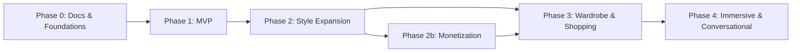

# Lumora — Roadmap

| Field | Value |
|---|---|
| Status | Active source of truth |
| Related | [PROJECT.md](./PROJECT.md) · [MVP.md](./MVP.md) · [TASKS.md](./TASKS.md) · [PROGRESS.md](./PROGRESS.md) · [DECISIONS.md](./DECISIONS.md) |

---

## 1. Purpose

This document sequences Lumora delivery from documentation and MVP through post-MVP expansion. Dates are intentionally omitted until a schedule is decided.

---

## 2. North Star

**Scan. Analyze. Transform.**

Build a trusted personal styling pipeline: guided capture → analysis → personalized recommendations → lasting history — then expand into broader style domains.

---

## 3. Phases

Monetization (Guest → Free credits → Pro) may start once MVP is stable and at least one generation surface exists to gate. Full Pro value (glasses, beard, outfit, Makeover) scales with Phase 2–3 feature availability. See [MONETIZATION.md](./MONETIZATION.md).
---

## 4. Phase 0 — Documentation & Foundations

| Goal | Outcome |
|---|---|
| Product clarity | Lumora identity and MVP locked in docs |
| Architecture clarity | NestJS-mediated AI boundaries documented |
| Delivery clarity | Tasks/progress tracking established |

**Exit criteria**

- [x] Core docs set created under `docs/`
- [ ] Open critical decisions recorded as they are made (auth, landmark payload, AI model approach)
- [ ] Team/agents follow `.cursor/agent.md`

---

## 5. Phase 1 — MVP

**Scope:** see [MVP.md](./MVP.md)

| Capability | Phase 1 |
|---|---|
| Authentication | Yes |
| Guided Face Scan | Yes |
| MediaPipe Face Landmarks | Yes |
| Face Shape Detection | Yes |
| Hair Recommendation | Yes |
| Recommendation History | Yes |

**Exit criteria**

- [ ] End-to-end authenticated scan → analysis → hair recommendations works
- [ ] History persists and is user-scoped
- [ ] Frontend never calls FastAPI
- [ ] MVP acceptance checklist complete

---

## 6. Phase 2 — Style Expansion

Extend recommendation domains using the same architecture.

| Feature | Notes |
|---|---|
| Glasses recommendation | New recommendation category behind NestJS → AI |
| Beard recommendation | Same pattern |
| Color analysis | May require additional inputs/features |

**Exit criteria (phase-level)**

- [ ] At least one new recommendation category shipped with history support
- [ ] No new client→AI path introduced

---

## 7. Phase 2b — Monetization & Access Control

**Scope:** see [MONETIZATION.md](./MONETIZATION.md) · ADR-022

Introduce the conversion funnel without changing NestJS-mediated AI boundaries.

| Capability | Notes |
|---|---|
| Guest one-hairstyle preview | Same landmarks pipeline; lock after first generation |
| Free monthly credits (10) | Unified credit wallet; server-side debit |
| Credit costs per action | Hair/glasses/beard/hat/palette = 1; outfit = 2 |
| Lumora Pro subscription | Unlimited credits + HD / no watermark / priority |
| **Mock payment checkout** | Pricing → mock card → OTP → Pro; [PAYMENTS.md](./PAYMENTS.md) · ADR-023 |
| **Shared VerificationService** | Payment + password reset OTP; [VERIFICATION.md](./VERIFICATION.md) · ADR-024 |
| AI Complete Makeover | Pro-only flagship (requires multi-category support) |
| Benefit-led paywalls | Guest→Free and Free→Pro copy from MONETIZATION.md |

**Exit criteria (phase-level)**

- [ ] NestJS enforces Guest / Free / Pro before FastAPI calls
- [ ] Free users receive and spend monthly credits correctly
- [ ] Credits = 0 surfaces Pro paywall with benefit list
- [ ] Mock checkout activates Pro + invoice + admin Telegram (no real PSP)
- [ ] VerificationService shared by payment and password reset
- [ ] Complete Makeover is Pro-exclusive when the feature ships

---

## 8. Phase 3 — Wardrobe & Shopping

| Feature | Notes |
|---|---|
| Outfit recommendation | New domain + data model |
| Wardrobe | User-owned items; NestJS + MongoDB |
| Shopping | Product discovery / affiliate / catalog — model TBD |

**Exit criteria (phase-level)**

- [ ] Wardrobe CRUD (or equivalent) available to authenticated users
- [ ] Outfit recommendations integrate with existing face/style profile where relevant

---

## 9. Phase 4 — Immersive & Conversational

| Feature | Notes |
|---|---|
| Virtual try-on | New pipeline; still NestJS-mediated |
| Chat | Conversational styling assistant domain |

**Exit criteria (phase-level)**

- [ ] Try-on or chat reaches usable beta without breaking MVP trust boundaries

---

## 10. Cross-Cutting Work (All Phases)

| Track | Examples |
|---|---|
| Security | Auth hardening, AI service auth, data retention |
| Reliability | Timeouts, observability, error budgets (as decided) |
| Model quality | Improve face shape / recommendation relevance |
| Platform | Monorepo tooling decisions, CI, deployment topology |

These do not override MVP scope gates.

---

## 11. Explicit Non-Roadmap for Now

Unless decided otherwise, do not prioritize:

- Becoming an AI image generator product
- Public AI API for third parties
- Unscoped “platform rewrite” before MVP works

---

## 12. Planning Rules

| Rule | Detail |
|---|---|
| MVP first | Phase 2+ does not start as a substitute for unfinished MVP |
| Decision logging | Phase transitions that change architecture update [DECISIONS.md](./DECISIONS.md) |
| No silent scope creep | New feature ideas go to roadmap/decisions, not silently into MVP tasks |

---

## 13. Summary

Lumora ships in layers: **docs → MVP hair pipeline → expanded style recommendations → monetization (Guest/Free/Pro credits) → wardrobe/shopping → try-on/chat**, always preserving NestJS-mediated AI architecture.
