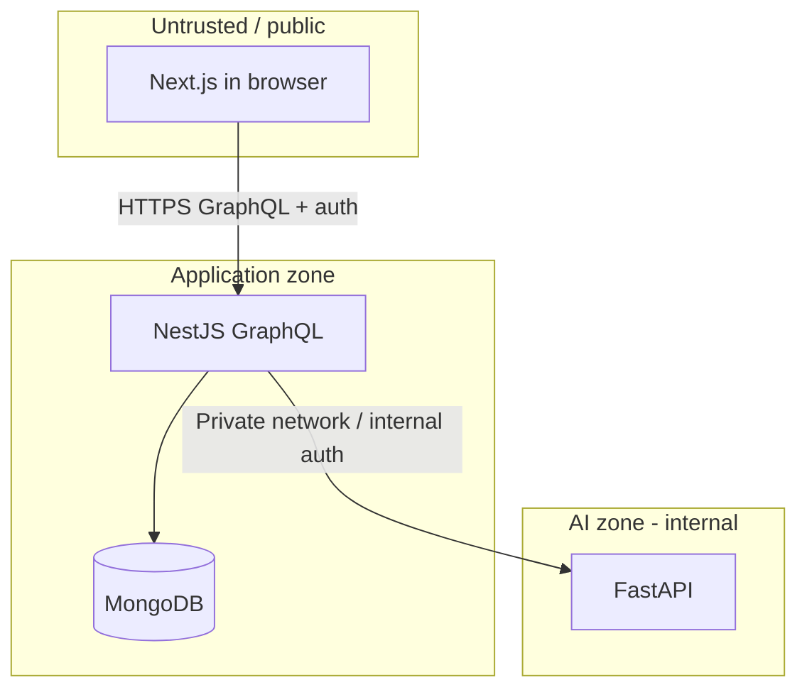

# Lumora — Security

| Field | Value |
|---|---|
| Status | Active source of truth |
| Related | [ARCHITECTURE.md](./ARCHITECTURE.md) · [API.md](./API.md) · [DATABASE.md](./DATABASE.md) · [AI.md](./AI.md) · [DEVELOPMENT_RULES.md](./DEVELOPMENT_RULES.md) |

---

## 1. Purpose

This document defines security requirements and trust boundaries for Lumora MVP. It focuses on architecture-enforced controls first, then auth, data protection, and operational rules.

---

## 2. Security Goals

| Goal | Description |
|---|---|
| Protect accounts | Authentication required for sensitive operations |
| Protect biometric-adjacent data | Landmarks / face analysis data are sensitive |
| Enforce AI isolation | AI service is not publicly reachable from browsers |
| Prevent cross-user data leaks | History and analyses are user-scoped |
| Fail safe | Invalid auth or upstream AI failures do not expose internals |

---

## 3. Trust Boundaries

| Boundary | Rule |
|---|---|
| Browser → NestJS | Public application entry |
| Browser → FastAPI | **Denied** |
| Browser → MongoDB | **Denied** |
| NestJS → FastAPI | Allowed, internal |
| NestJS → MongoDB | Allowed |
| FastAPI → MongoDB | Not part of default architecture |

---

## 4. Authentication & Authorization (MVP)

### 4.1 Providers (ADR-009)

| Method | Status |
|---|---|
| Email + password | Required |
| Google OAuth | Required |
| Kakao OAuth | Out of MVP |
| Phone OTP/SMS | Out of MVP |

### 4.2 Token transport (ADR-010)

| Topic | Decision |
|---|---|
| Access token | JWT |
| Client header | `Authorization: Bearer <token>` |
| Refresh tokens / TTLs | Still open (OPEN-014) |

### 4.3 Required behaviors

| Requirement | Detail |
|---|---|
| Authentication exists | Users can register/sign in via supported providers |
| Protected operations | `analyzeFace`, history queries, `me` require valid Bearer JWT |
| Password handling | Hash with a modern algorithm; never store plaintext |
| Token/session secrecy | `JWT_SECRET` and OAuth client secrets only in server env |
| Account linking | Multiple providers may map to one user identity model |

### 4.4 Authorization rules

| Resource | Rule |
|---|---|
| Recommendation history | Only owning `userId` |
| Face analysis records | Only owning `userId` |
| Admin-style access | Not in MVP |

### 4.5 Still open

| Decision | Status |
|---|---|
| Refresh token strategy + JWT TTLs | OPEN-014 |
| MFA | Out of MVP unless later decided |
| Google-only forgot-password UX | OPEN-021 |

### 4.6 Shared verification & password recovery (Phase 2b)

See [VERIFICATION.md](./VERIFICATION.md) · ADR-024.

| Control | Rule |
|---|---|
| OTP | 6 digits; 2 min expiry; max 5 attempts; one active per user+purpose |
| Storage | Prefer hashed OTP; never log codes |
| Password policy | Min 8; upper + lower + digit + special |
| After reset | Invalidate all sessions/refresh tokens; force re-login; audit + admin Telegram |
| Channels | MVP: email / Google email; PaymentService must not send OTP itself |

### 4.7 Mock payments (Phase 2b)

See [PAYMENTS.md](./PAYMENTS.md) · ADR-023.

| Control | Rule |
|---|---|
| No real PSP | Mock provider only until a real gateway is chosen |
| Card data | Do not store PAN/CVV; last4/brand only if needed |
| Entitlements | Only NestJS activates `plan=PRO` after verified SUCCESS |
| Admin alerts | Telegram via NotificationService (OPEN-022) |

---

## 5. AI Service Security

| Control | Requirement |
|---|---|
| Network exposure | FastAPI must not be designed as a public browser API |
| Development | Private network; no service auth required (ADR-019) |
| Production | Private network + shared secret header `X-API-KEY` (ADR-019) |
| Input validation | Reject malformed landmark payloads |
| Output safety | Do not return stack traces or model internals to public clients |
| Data minimization | MVP analyze path is **landmarks-only** (ADR-011); no face image upload |

---

## 6. Data Protection

| Data class | Examples | Handling |
|---|---|---|
| Secrets | `JWT_SECRET`, DB URIs, AI service keys | Env/secret manager only |
| Credentials | Passwords | Hash only |
| PII | Email, display name | Access-controlled; user-scoped APIs |
| Sensitive biometric-adjacent | Landmarks, face shape, scan artifacts | Authz + minimization; retain until user deletes (ADR-020) |
| Recommendation history | Hair recs | User-scoped reads; retain until user deletes |

### Rules

| Rule ID | Rule |
|---|---|
| SEC-01 | No secrets in source control |
| SEC-02 | No FastAPI base URL intended for browser clients in frontend env |
| SEC-03 | GraphQL must not leak other users’ entities |
| SEC-04 | Logs must avoid dumping full sensitive payloads in production |
| SEC-05 | HTTPS required for deployed public API |

---

## 7. GraphQL / API Security Controls

| Control | MVP expectation |
|---|---|
| Auth guards | On all sensitive resolvers/mutations |
| Input validation | Landmark payload schema validation in NestJS |
| Rate limiting | Recommended; exact tool open |
| Introspection / playground | Disable or restrict in production (recommended) |
| CORS | Allow only known frontend origins in deployed envs |

---

## 8. Dependency & Supply Chain

| Practice | Expectation |
|---|---|
| Lockfiles | Commit package lockfiles for Node; equivalent for Python once AI package exists |
| Secrets scanning | Do not commit `.env` |
| Least privilege | DB users and AI credentials scoped to need |

---

## 9. Threat Model (MVP-focused)

| Threat | Mitigation |
|---|---|
| Client calls AI directly | Architecture + network/firewall + no public AI docs for clients |
| Stolen access token | Short TTL / refresh rotation (once strategy decided); HTTPS |
| IDOR on history | Always filter by auth user id |
| Landmark spoofing | Auth required; treat as untrusted input; validate schema |
| Secret leakage in repo | `.gitignore`, env-only secrets, review discipline |
| Verbose AI errors to users | NestJS maps upstream errors to safe messages |

---

## 10. Secure Development Rules

| Rule | Detail |
|---|---|
| Security docs first for boundary changes | Changing client→AI paths requires architecture + security update |
| No production credentials in screenshots/issues | Redact |
| Review authz on every new query/mutation | Default deny for user data |

See also [DEVELOPMENT_RULES.md](./DEVELOPMENT_RULES.md) and [CODING_STANDARDS.md](./CODING_STANDARDS.md).

---

## 11. Open Security Decisions

| Decision | Status |
|---|---|
| Refresh token / JWT TTLs | OPEN-014 |
| Account-deletion UX timing | OPEN-017 |
| Rate limiting technology | Open |
| WAF / API gateway | Open |
| Formal compliance target | Open |

---

## 12. Summary

Lumora security: **public GraphQL on NestJS**, **private FastAPI**, MongoDB behind NestJS; **JWT Bearer**; auth = **email/password + Google**; **landmarks-only**; prod AI calls require **`X-API-KEY`**; data retained until **account deletion**. Phase 2b adds mock payments + shared OTP verification without storing raw card data.
