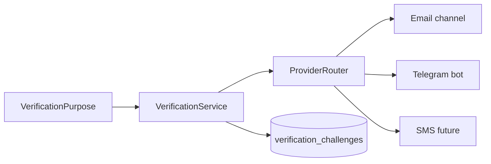
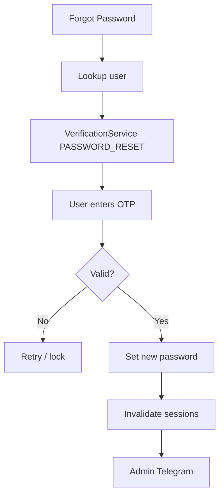

# Lumora — Verification & Password Recovery

| Field | Value |
|---|---|
| Status | Accepted product strategy |
| Related | [PAYMENTS.md](./PAYMENTS.md) · [SECURITY.md](./SECURITY.md) · [API.md](./API.md) · [DATABASE.md](./DATABASE.md) · [DECISIONS.md](./DECISIONS.md) |
| ADR | ADR-024 |

---

## 1. Purpose

Define Lumora’s **shared VerificationService** and the **Forgot Password** flow.

OTP / challenge delivery is **dynamic**: the destination depends on how the user authenticated. Payment, password reset, and future sensitive actions **reuse one infrastructure** — no duplicated OTP stacks.

---

## 2. Shared Verification Infrastructure

```text
VerificationService
├── Email Verification
├── Payment Verification
├── Forgot Password
├── Change Email
├── Change Phone Number
├── Delete Account Confirmation
├── Enable 2FA
├── Disable 2FA
└── Sensitive Account Actions
```



| Concern | Owner |
|---|---|
| Create / expire / verify OTP | `VerificationService` |
| Choose channel from auth provider | `ProviderRouter` inside verification module |
| Send message | `NotificationService` (email, Telegram, SMS, …) |
| Callers | Payment, Auth (password reset), Account settings, … |

Callers must **not** implement their own OTP generators or senders.

---

## 3. Verification Purpose Enum (Logical)

```text
EMAIL_VERIFY
PAYMENT
PASSWORD_RESET
CHANGE_EMAIL
CHANGE_PHONE
DELETE_ACCOUNT
ENABLE_2FA
DISABLE_2FA
SENSITIVE_ACTION
```

Each challenge is scoped by `userId` + `purpose` (+ optional `resourceId`).

---

## 4. Dynamic Verification Provider

Destination follows the account’s auth provider:

| Auth provider | OTP destination | MVP? |
|---|---|---|
| Email/password | Email | **Yes** |
| Google OAuth | Google account email | **Yes** |
| Telegram login | Telegram bot | Future |
| Phone | SMS | Future |
| Apple | Apple email | Future |
| Kakao | Kakao message | Future |
| Naver | Naver email | Future |

Backend **auto-selects** the channel. Clients do not pick the provider.

**MVP auth remains email + Google** (ADR-009). Future providers plug into the same router without new OTP engines.

---

## 5. Verification Rules

| Rule | Value |
|---|---|
| OTP format | Random **6-digit** code |
| Expiry | **2 minutes** |
| Max attempts | **5** |
| Active challenges | **One** active OTP per `userId` + `purpose` |
| Resend | Issues new OTP and **invalidates** the previous |
| Sensitive action gate | Action allowed only after successful verify |

Store hashes of OTPs (or one-way digests), not plaintext, when practical. Rate-limit create/resend by user and IP.

---

## 6. Forgot Password Workflow

```text
User
  → Forgot Password
  → Enter email (or username if supported)
  → Backend finds user
  → Detect auth provider
  → Generate 6-digit OTP (purpose = PASSWORD_RESET)
  → Send OTP via provider channel
  → User enters code
  → Backend verifies OTP
  → Allow password reset
  → User sets new password (policy below)
  → Password updated
  → Invalidate all sessions / refresh tokens
  → Require login again
  → Admin Telegram notification
```



### 6.1 Google / OAuth-only accounts

| Case | Behavior |
|---|---|
| Email/password user | Full forgot-password + set new `passwordHash` |
| Google-only user (no password) | OTP still proves identity; flow may **set** a password (link local credential) **or** redirect to “Sign in with Google” — product choice OPEN-021 |
| Mixed providers | Prefer email channel associated with the account; still invalidate all sessions on reset |

---

## 7. Password Policy

New password must satisfy **all**:

| Rule | Requirement |
|---|---|
| Length | Minimum **8** characters |
| Uppercase | At least one `A–Z` |
| Lowercase | At least one `a–z` |
| Number | At least one digit |
| Special | At least one special character |

Enforce on backend (never UI-only). Reject weak passwords with a clear GraphQL error code.

---

## 8. Security After Successful Reset

| Action | Required |
|---|---|
| Invalidate all refresh tokens | Yes |
| Invalidate active sessions | Yes |
| Force re-login | Yes |
| Record password-reset event / audit log | Yes |
| Admin Telegram notification | Yes |

---

## 9. Administrator Telegram Notification

On successful password reset:

```text
━━━━━━━━━━━━━━━━━━━━
🔑 PASSWORD RESET

User:
John Doe

User ID:
USR_10291

Authentication:
Google OAuth

Identifier:
john@gmail.com

Verification:
Google Email

Status:
SUCCESS

Time:
2026-07-21 18:15 KST
━━━━━━━━━━━━━━━━━━━━
```

Same `NotificationService` path as payment success alerts ([PAYMENTS.md](./PAYMENTS.md)).

---

## 10. Payment Verification (Consumer)

Payment checkout OTP is **not** a separate system. See [PAYMENTS.md](./PAYMENTS.md) §9:

- `purpose = PAYMENT`
- Same rules (6 digits, 2 min, 5 attempts, single active)
- Same provider routing table

---

## 11. Data Model (Logical)

| Collection / field | Purpose |
|---|---|
| `verification_challenges` | `userId`, `purpose`, `codeHash`, `channel`, `attempts`, `expiresAt`, `consumedAt` |
| `users.passwordHash` | Updated after reset (email users / optional Google link) |
| `refresh_tokens` / sessions | Cleared on successful reset |
| `audit_events` (optional) | Password reset / payment verify success |

---

## 12. API Surface (Logical)

| Operation | Auth | Purpose |
|---|---|---|
| `requestPasswordReset` | Public | Start OTP for email lookup |
| `confirmPasswordReset` | Public (reset token / challenge id) | Verify OTP + set password |
| `resendVerification` | Context-dependent | Resend for active purpose |
| Payment confirm/resend | Required | See PAYMENTS.md |

Do not reveal whether an email exists beyond safe generic responses where abuse matters (enumeration hardening).

---

## 13. Phase Placement

| Capability | Phase |
|---|---|
| VerificationService core + email channel | With auth hardening / Phase 2b |
| Google-email OTP routing | With auth (MVP providers) |
| Forgot password | Auth fast-follow or Phase 2b |
| Payment OTP | Phase 2b ([PAYMENTS.md](./PAYMENTS.md)) |
| Telegram / SMS / Kakao / Apple / Naver channels | When those login providers ship |
| 2FA / change email / delete confirm | Later account-security work |

---

## 14. Change Control

- OTP rules and purposes change in **this file** first
- Payment-specific UX stays in [PAYMENTS.md](./PAYMENTS.md)
- Auth provider list for MVP stays ADR-009 unless superseded

---

## 15. Summary

Lumora uses one **VerificationService** for payment, password reset, and future sensitive actions. OTP is 6 digits, 2-minute expiry, 5 attempts, one active challenge per purpose; channel selection follows the user’s auth provider. Password reset enforces a strong password policy, kills all sessions, and notifies admins on Telegram.
