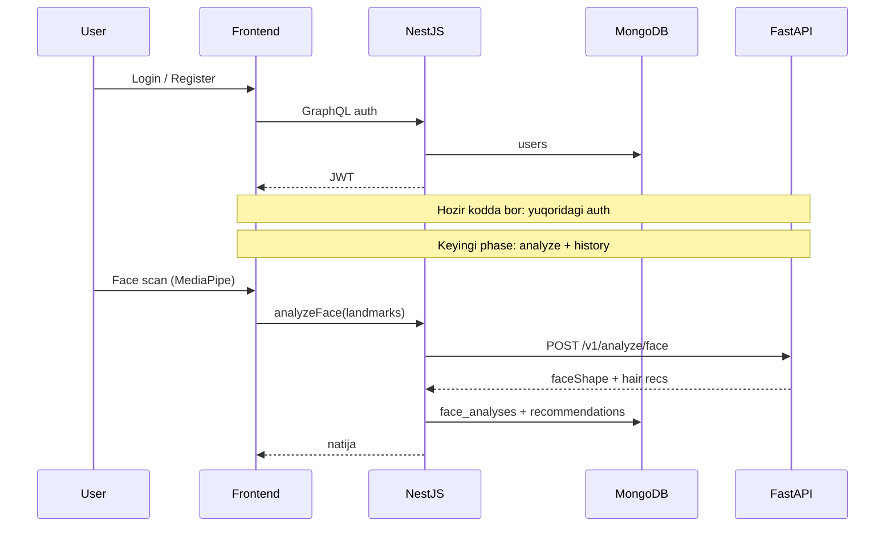

# 00 — Platform System Design

> Maqsad: ko‘zingizda **butun Lumora backend** ni qutilar sifatida ko‘rish.

---

## 1. Nima uchun bu “modul” bor

Bu bitta NestJS module emas. Bu — **context diagram**.

Agar system design intervyuda chizsangiz, birinchi chizadigan rasm shu.

## 2. Qanday muammoni yechadi

Yirik tizimni chalkashtirmaslik:

| Xavf | Yechim |
|---|---|
| Frontend to‘g‘ridan AI chaqiradi | Taqiqlangan |
| AI user DB ni boshqaradi | Taqiqlangan |
| Hammasi bitta repo/monolit chalkash | 3 repo, aniq chegaralar |

## 3. Workflow (tasavvur qil)

### 3.1 Context (C4 Level 1)

```text
┌─────────────┐     GraphQL HTTPS      ┌──────────────────┐
│  Browser /  │ ─────────────────────► │  lumora-backend  │
│  Next.js    │ ◄───────────────────── │  NestJS+GraphQL  │
└─────────────┘      JWT + JSON        └────────┬─────────┘
                                                │
                         ┌──────────────────────┼──────────────────────┐
                         │                      │                      │
                         ▼                      ▼                      ▼
                  ┌─────────────┐       ┌──────────────┐       ┌─────────────┐
                  │  MongoDB    │       │  lumora-ai   │       │  Google     │
                  │  users/…    │       │  FastAPI     │       │  ID token   │
                  └─────────────┘       └──────────────┘       └─────────────┘
```

### 3.2 End-to-end MVP oqimi (kelajak + hozir)



### 3.3 Hozirgi “ready” qism (qizil chiziq)

```text
READY BUGUN          |  KEYINGI PHASE
---------------------|------------------
Auth + Users + JWT   |  analyzeFace
Health               |  AI client
App bootstrap        |  history
                     |  Docker / CI
```

## 4. Controller / Service (qatlamlar)

System design da “layer” deb o‘ylang:

| Qatlam | Bu repoda | Vazifa |
|---|---|---|
| Edge | `main.ts`, CORS, pipes | HTTP kirish |
| API | GraphQL resolvers | Contract |
| Domain | `AuthService`, keyin AnalysisService | Biznes qoida |
| Data | `UsersService`, Mongoose | Persistence |
| External | Google, keyin FastAPI | 3rd party |

**Qoida:** External’ga faqat domain orqali chiqiladi (FE → AI yo‘q).

## 5. Muhim methodlar / kod (ankorlar)

| Tushuncha | Kod |
|---|---|
| App wiring | `src/app.module.ts` |
| Auth API | `src/auth/auth.resolver.ts` |
| User store | `src/users/schemas/user.schema.ts` |
| Public contract | `src/schema.gql` |

## 6. Summary

Lumora backend — **orkestrator qutisi**: trust (auth) + keyin AI chaqiriq + saqlash.  
O‘qishda doim so‘rang: *“Bu so‘rov qaysi qutidan qaysi qutiga o‘tdi?”*
