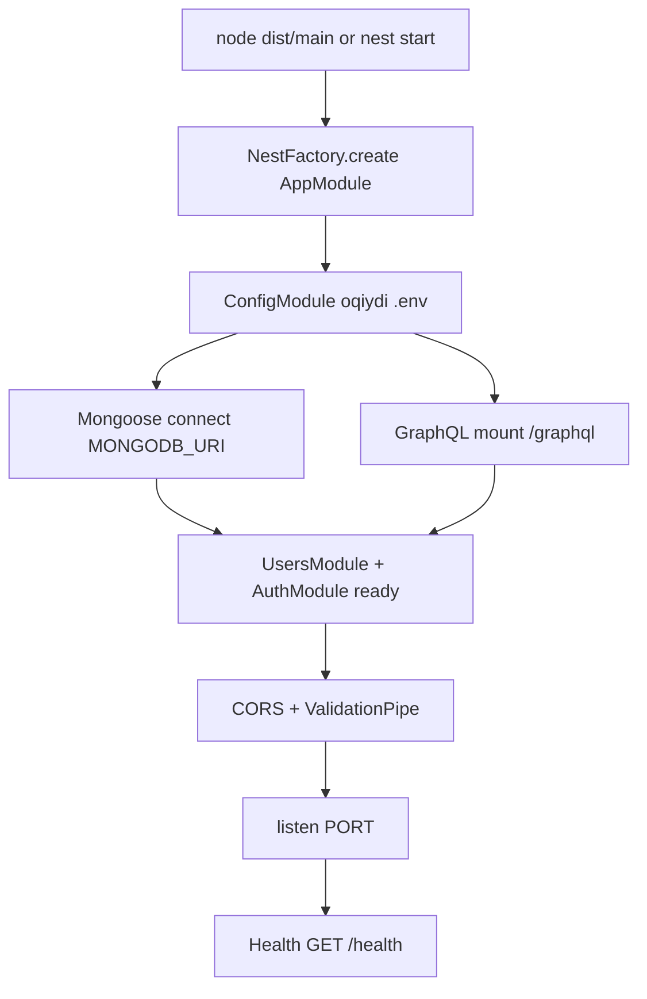

# 01 — App Bootstrap System Design

> Maqsad: bitta Node process qanday **composition root** bo‘lishini tasavvur qilish.

---

## 1. Nima uchun bu modul bor

Har qanday backendda birinchi savol: **process qanday yonadi?**

`main.ts` + `AppModule` = dependency graph ning ildizi (composition root).

## 2. Qanday muammoni yechadi

| Muammo | Bootstrap yechimi |
|---|---|
| Env chalkash | `ConfigModule` |
| DB ulanmasdan start | `MongooseModule.forRootAsync` |
| API contract yo‘q | `GraphQLModule` + `schema.gql` |
| Yomon input | global `ValidationPipe` |
| Cross-origin FE | CORS |

## 3. Workflow (tasavvur qil)

### 3.1 Start sequence



### 3.2 So‘rov kelganda (runtime path)

```text
HTTP request
   │
   ├─ /health ──────────────► HealthController
   │
   └─ /graphql ─────────────► Apollo/Nest GraphQL
                                │
                                ├─ public: register/login/...
                                └─ guarded: me/logout (+ keyin analyze)
                                     │
                                     └─ JwtStrategy → UsersService → Mongo
```

## 4. Controller / Service

Bu yerda business service yo‘q — **infrastructure wiring**.

| Komponent | System design roli |
|---|---|
| `ConfigModule` | Configuration store |
| `MongooseModule` | Database adapter |
| `GraphQLModule` | API gateway (app-level) |
| Feature modules | Bounded contexts |

`AppModule` imports tartibi = “tizim qanday yig‘iladi”.

## 5. Muhim methodlar / kod

**`main.ts`**

- CORS: prod’da allowlist (`CORS_ORIGINS`)
- `ValidationPipe`: whitelist + forbidNonWhitelisted
- PORT: string → `parseInt`

**`app.module.ts`**

- `autoSchemaFile` → `src/schema.gql` (commit qilinadi)
- `playground: NODE_ENV !== 'production'`

Savol o‘zingizga: *“Agar Mongo o‘chsa, qaysi qadam fail bo‘ladi?”* → Mongoose connect.

## 6. Summary

Bootstrap = **process + wiring**. Domain bu yerda yozilmaydi.  
System design chizmasida bu “Runtime Platform” qutisi.
