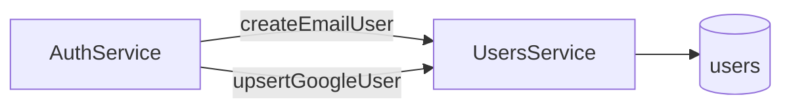

# 02 — Users System Design

> Maqsad: **Identity store** ni alohida quti sifatida ko‘rish (Auth dan ajratilgan).

---

## 1. Nima uchun bu modul bor

System design da Auth ≠ User DB.

- Auth: “kimligini isbotlash” (credential / token)
- Users: “kimligini saqlash” (record)

Shuning uchun `UsersModule` alohida bounded context.

## 2. Qanday muammoni yechadi

| Muammo | Yechim |
|---|---|
| Qayerda user yashaydi? | Mongo `users` |
| Parol sizib chiqmasin | `passwordHash` + `select: false` |
| Google va email bir odam | `providers[]` + upsert/link |
| Duplicate email | unique index |

## 3. Workflow (tasavvur qil)

### 3.1 Data model (mental model)

```text
User
├── id
├── email                  ← MVP da majburiy + unique
├── passwordHash?          ← faqat email user
├── providers[]            ← { type, subject, linkedAt }
│     ├── email
│     └── google
├── displayName?
└── locale?
```

### 3.2 Write path



### 3.3 Google link (muhim case)

```text
Google login keldi
  │
  ├─ providers.google.subject topildimi? → shu user
  │
  ├─ email bo‘yicha user bormi?
  │     ha → providers ga google qo‘sh (account link)
  │
  └─ yo‘q → yangi user yarat
```

Bu — **identity federation** ning soddalashtirilgan shakli.

## 4. Controller / Service

| Qism | Rol (system design) |
|---|---|
| GraphQL User type | Read model (API) |
| `User` schema | Persistence model |
| `UsersService` | Repository / data access |

**Resolver yo‘q** — Users ichki API. Tashqariga Auth orqali chiqadi.

## 5. Muhim methodlar / kod

| Method | Qachon |
|---|---|
| `findById` | JWT `sub` |
| `findByEmail` | register duplicate |
| `findByEmailWithPassword` | login (hash kerak) |
| `findByProvider` | Google subject |
| `createEmailUser` | register |
| `upsertGoogleUser` | Google login / link |

Kod ankor: `src/users/users.service.ts`, `src/users/schemas/user.schema.ts`.

## 6. Summary

Users = **Source of Truth for identity records**.  
Auth Users’siz “bo‘sh eshik”; Users Auth’siz “qulflanmagan ombor”.
