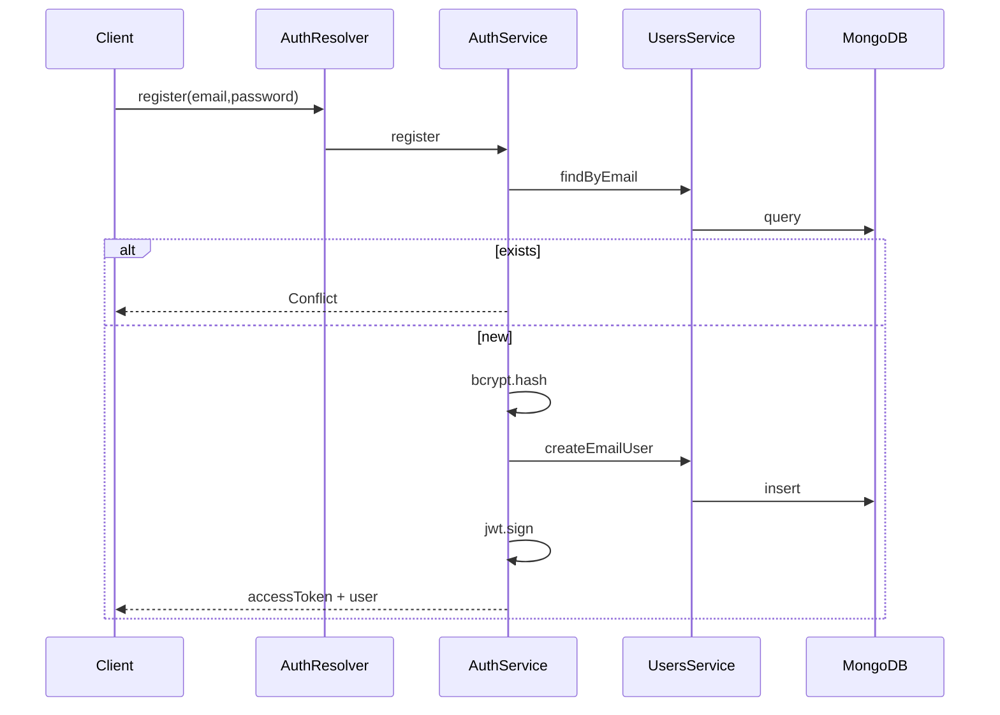

# 03 — Auth System Design

> Maqsad: **Trust boundary** ni chizib, token asosidagi session’ni tushunish.

---

## 1. Nima uchun bu modul bor

Public internet’dan kelgan har so‘rov ishonchsiz.

Auth moduli:

1. Identity’ni isbotlaydi (password / Google)
2. Qisqa muddatli **access token** beradi
3. Himoyalangan operatsiyalarni guard qiladi

Bu — MVP ning birinchi production-critical bounded context.

## 2. Qanday muammoni yechadi

| Muammo | Yechim |
|---|---|
| Kim bu user? | register/login/Google |
| Keyingi so‘rovda qayta login? | JWT Bearer |
| Parol o‘g‘irlansa? | bcrypt (12 rounds), plaintext yo‘q |
| Google fake token? | `verifyIdToken` + audience + verified email |
| Boshqa user data’sini ko‘rish | `me` faqat token `sub` |

**Hali ochiq (OPEN-014):** refresh token / server-side revoke.  
Hozir: access-token-only; `logout` = client token’ni tashlaydi.

## 3. Workflow (tasavvur qil)

### 3.1 Trust boundary chizmasi

```text
                    PUBLIC                         TRUSTED
         ┌─────────────────────────┐      ┌──────────────────────┐
         │  register / login /     │      │  me / logout         │
         │  loginWithGoogle        │      │  (keyin analyze...)  │
         └───────────┬─────────────┘      └──────────▲───────────┘
                     │                               │
                     │  issues JWT                   │ requires JWT
                     └──────────────► JWT ───────────┘
```

### 3.2 Register sequence



### 3.3 Protected request

```text
Authorization: Bearer eyJ...
        │
        ▼
 GqlAuthGuard
        │
        ▼
 JwtStrategy.validate(payload.sub)
        │
        ▼
 UsersService.findById
        │
        ▼
 req.user = UserModel → resolver
```

### 3.4 Google path (external dependency)

```text
Frontend Google SDK → idToken
        │
        ▼
AuthService.loginWithGoogle
        │
        ▼
Google tokeninfo/verify (audience=GOOGLE_CLIENT_ID)
        │
        ├─ invalid → 401
        ├─ email unverified → 401
        └─ ok → upsertGoogleUser → JWT
```

## 4. Controller / Service

GraphQL da Controller o‘rniga **Resolver** (same layer).

| Komponent | System design roli |
|---|---|
| `AuthResolver` | API adapter |
| `AuthService` | Auth use-cases |
| `JwtModule` / `JwtStrategy` | Token issuer + authenticator |
| `GqlAuthGuard` | Authorization gate |
| DTOs | Input validation boundary |
| `toUserModel` | Anti-corruption (DB → API) |

## 5. Muhim methodlar / kod

| Method | Fayl | Esda saqla |
|---|---|---|
| `register` / `login` / `loginWithGoogle` | `auth.service.ts` | Use-cases |
| `me` / `logout` | resolver + service | Protected |
| `validate` | `jwt.strategy.ts` | Har guarded so‘rov |
| `toUserModel` | `mappers/to-user-model.ts` | Bitta mapping |

JWT payload mental model: `{ sub: userId, email }`.

## 6. Summary

Auth = **identity proof + token gate**.  
Chizganda doim ikki zona: Public entry vs Trusted ops.  
Keyingi analyze moduli shu Trusted zonaga ulanadi.
