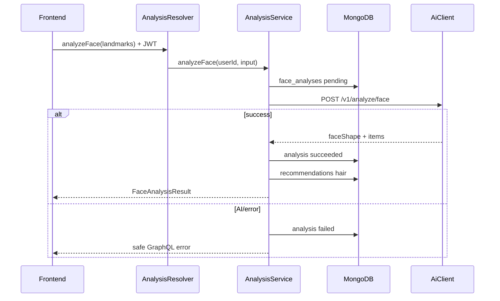

# 05 — Analysis System Design

> Maqsad: `analyzeFace` ni **orchestration bounded context** sifatida ko‘rish.

---

## 1. Nima uchun bu modul bor

Frontend landmarks yuboradi. AI face shape + hair recs qaytaradi.  
Lekin **saqlash, auth, xato mapping** NestJS da bo‘lishi kerak.

`AnalysisModule` shu orkestratsiyani qiladi.

## 2. Qanday muammoni yechadi

| Muammo | Yechim |
|---|---|
| Kim analyze qila oladi? | JWT guard |
| Landmarks formati? | ADR-025 contract |
| AI down bo‘lsa? | `face_analyses=failed`, recommendation yaratilmaydi |
| History kimniki? | `userId` filter (no IDOR) |

## 3. Workflow (tasavvur qil)

## 4. Controller / Service

| Qism | Rol |
|---|---|
| `AnalysisResolver` | GraphQL API |
| `AnalysisService` | Use-cases + persistence rules |
| Schemas | `face_analyses`, `recommendations` |

## 5. Muhim methodlar / kod

| Method | Vazifa |
|---|---|
| `analyzeFace` | pending → AI → success/fail |
| `recommendationHistory` | cursor pagination, user-scoped |
| `recommendation` | single item, user-scoped |

Kod: `src/analysis/`.

## 6. Summary

Analysis = **trusted zone** dagi orkestrator. AI natijasini ishonchli qilib saqlaydi va history beradi.
